# 数据库 ER 关系图

## 完整的实体关系图

```mermaid
erDiagram
    %% 用户和认证相关
    profiles {
        uuid user_id PK
        varchar full_name
        varchar email
        varchar role
        bool is_super_admin
        timestamp created_at
        timestamp updated_at
    }
    
    admin_users {
        uuid user_id PK
        text role
        bool is_super_admin
    }
    
    %% 业务档案相关
    business_profiles {
        uuid id PK
        uuid user_id FK
        varchar business_name
        varchar business_email
        varchar business_phone
        text business_address
        varchar website
        jsonb business_hours
        bool is_active
        timestamp created_at
    }
    
    business_types {
        uuid id PK
        varchar name
        varchar description
        jsonb default_config
        bool is_active
    }
    
    %% AI 代理相关
    ai_agents {
        uuid id PK
        uuid user_id FK
        varchar name
        varchar type
        text description
        jsonb configuration
        bool is_active
        varchar retell_agent_id
        timestamp created_at
    }
    
    agent_configurations {
        uuid id PK
        uuid agent_id FK
        uuid client_id FK
        varchar business_name
        varchar business_type
        jsonb voice_settings
        jsonb working_hours
        bool is_active
    }
    
    agent_templates {
        uuid id PK
        varchar name
        varchar category
        text base_prompt
        jsonb default_settings
        bool is_active
    }
    
    %% 产品和服务
    business_products {
        uuid id PK
        uuid user_id FK
        varchar name
        text description
        numeric price
        varchar category
        bool is_active
    }
    
    business_services {
        uuid id PK
        uuid user_id FK
        varchar name
        text description
        numeric price
        integer duration_minutes
        bool is_active
    }
    
    product_categories {
        uuid id PK
        uuid user_id FK
        varchar name
        text description
        int sort_order
    }
    
    %% 员工管理
    staff_members {
        uuid id PK
        uuid user_id FK
        uuid location_id FK
        varchar first_name
        varchar last_name
        varchar email
        varchar phone
        jsonb schedule
        bool is_active
    }
    
    staff_availability {
        uuid id PK
        uuid staff_id FK
        date date
        jsonb time_slots
        bool is_available
    }
    
    staff_calendars {
        uuid id PK
        uuid staff_id FK
        uuid user_id FK
        integer year
        bool default_generated
    }
    
    %% 预约系统
    appointment_types {
        uuid id PK
        uuid user_id FK
        varchar name
        text description
        integer duration_minutes
        numeric price
        bool is_active
    }
    
    appointment_bookings {
        uuid id PK
        uuid appointment_type_id FK
        uuid customer_id FK
        uuid staff_id FK
        timestamp start_time
        timestamp end_time
        varchar status
        jsonb metadata
    }
    
    customers {
        uuid id PK
        uuid user_id FK
        varchar name
        varchar email
        varchar phone
        text address
        jsonb metadata
        timestamp created_at
    }
    
    %% 工作岗位相关
    job_categories {
        uuid id PK
        uuid user_id FK
        varchar name
        text description
        int sort_order
    }
    
    job_types {
        uuid id PK
        uuid category_id FK
        uuid user_id FK
        varchar name
        text description
        integer duration_minutes
        numeric price
    }
    
    job_titles {
        uuid id PK
        uuid user_id FK
        varchar name
        varchar category
        text description
    }
    
    staff_job_assignments {
        uuid id PK
        uuid staff_id FK
        uuid job_type_id FK
        integer custom_duration_minutes
        numeric custom_price
        varchar proficiency_level
    }
    
    %% 营业地点
    business_locations {
        uuid id PK
        uuid user_id FK
        varchar name
        text address
        varchar phone
        jsonb operating_hours
        bool is_primary
    }
    
    %% 日历和时间管理
    office_hours {
        uuid id PK
        uuid user_id FK
        varchar day_of_week
        time open_time
        time close_time
        bool is_open
    }
    
    holidays {
        uuid id PK
        uuid user_id FK
        date date
        varchar name
        bool recurring
    }
    
    calendar_integrations {
        uuid id PK
        uuid user_id FK
        varchar provider
        jsonb credentials
        bool is_active
    }
    
    %% 通话记录
    customer_call_logs {
        uuid id PK
        uuid user_id FK
        uuid agent_id FK
        varchar customer_phone
        timestamp call_start
        timestamp call_end
        integer duration_seconds
        jsonb transcript
        varchar status
    }
    
    %% 关系定义
    profiles ||--o{ business_profiles : "has"
    profiles ||--o{ ai_agents : "owns"
    profiles ||--o{ business_products : "manages"
    profiles ||--o{ business_services : "provides"
    profiles ||--o{ staff_members : "employs"
    profiles ||--o{ appointment_types : "defines"
    profiles ||--o{ customers : "has"
    profiles ||--o{ business_locations : "operates"
    profiles ||--o{ job_categories : "creates"
    profiles ||--o{ job_types : "defines"
    profiles ||--o{ job_titles : "assigns"
    
    business_profiles ||--|| business_types : "is_type_of"
    
    ai_agents ||--o{ agent_configurations : "configured_by"
    ai_agents ||--o{ customer_call_logs : "handles"
    
    business_types ||--o{ agent_templates : "uses"
    
    business_locations ||--o{ staff_members : "works_at"
    
    staff_members ||--o{ staff_availability : "has"
    staff_members ||--o{ staff_calendars : "manages"
    staff_members ||--o{ appointment_bookings : "handles"
    staff_members ||--o{ staff_job_assignments : "assigned"
    
    job_categories ||--o{ job_types : "contains"
    job_types ||--o{ staff_job_assignments : "assigned_to"
    
    appointment_types ||--o{ appointment_bookings : "scheduled_as"
    customers ||--o{ appointment_bookings : "books"
    
    product_categories ||--o{ business_products : "categorizes"
```

## 核心业务流程

### 1. 用户注册和业务设置流程

### 2. 预约流程

### 3. 员工和工作分配流程

## 数据库设计特点

### 主要特性
1. **多租户架构**: 使用 `user_id` 实现数据隔离
2. **灵活的配置**: 大量使用 JSONB 字段存储动态配置
3. **审计追踪**: 所有主要表都有 `created_at` 和 `updated_at` 字段
4. **软删除**: 使用 `is_active` 字段而非物理删除
5. **UUID主键**: 所有表使用 UUID 作为主键，增强安全性

### 关键表说明

#### profiles (用户档案)
- 系统的核心用户表
- 所有其他业务数据都关联到此表
- 支持角色和权限管理

#### business_profiles (业务档案)
- 存储企业基本信息
- 一个用户可以有一个业务档案
- 关联到特定的业务类型

#### ai_agents (AI代理)
- 管理AI客服代理
- 支持多种配置选项
- 关联到Retell平台

#### staff_members (员工)
- 管理企业员工信息
- 支持复杂的排班和可用性设置
- 可分配多个工作类型

#### appointment_bookings (预约)
- 核心预约管理表
- 连接客户、员工和服务
- 支持状态跟踪和元数据存储

#### customer_call_logs (通话记录)
- 记录所有客服通话
- 包含完整的通话转录
- 用于分析和质量控制

### 数据完整性

1. **外键约束**: 所有关系都有适当的外键约束
2. **级联规则**: 适当使用CASCADE和RESTRICT规则
3. **唯一性约束**: 关键字段有唯一性约束
4. **检查约束**: 业务规则通过CHECK约束实施

### 性能优化

1. **索引策略**: 
   - 所有外键都有索引
   - 常用查询字段建立索引
   - 复合索引用于复杂查询

2. **分区策略**:
   - 大表如 `customer_call_logs` 可按时间分区
   - `appointment_bookings` 可按日期分区

3. **JSONB索引**:
   - 对常查询的JSONB字段建立GIN索引
   - 提高配置数据的查询性能