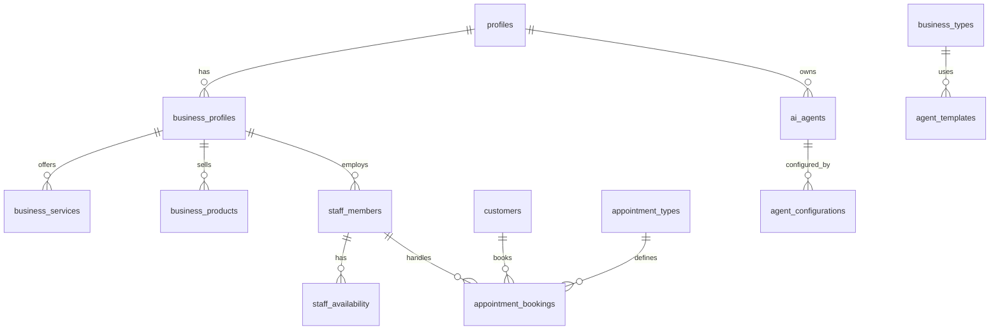

# 数据库文档

生成时间: 2025/8/11 22:02:19

## 数据库概览

总共 **45** 个表

## 表列表

- admin_users
- agent_configs
- agent_configurations
- agent_configurations_scoped
- agent_metrics
- agent_templates
- agent_translations
- agent_types
- agents
- ai_agents
- ai_call_logs
- appointment_bookings
- appointment_types
- appointments
- booking_settings
- business_accepted_insurance
- business_holidays
- business_knowledge
- business_locations
- business_products
- business_profiles
- business_service_types
- business_services
- business_type_agent_template_map
- business_types
- calendar_integrations
- call_logs
- clients --archive
- customer_call_logs
- customers
- email_notifications
- holidays
- insurance_providers
- job_categories
- job_titles
- job_types
- office_hours
- product_categories
- profiles
- staff_availability
- staff_calendar_configs
- staff_calendars
- staff_job_assignments
- staff_members
- supported_languages

## 表详细信息

### admin_users

| 字段名 | 数据类型 | 允许NULL | 默认值 |
|--------|----------|----------|--------|
| user_id | uuid | ✗ | - |
| role | text | ✓ | 'admin'::text |
| is_super_admin | boolean | ✓ | false |

---

### agent_configs

| 字段名 | 数据类型 | 允许NULL | 默认值 |
|--------|----------|----------|--------|
| id | uuid | ✗ | gen_uuid7() |
| user_id | uuid | ✗ | - |
| agent_name | character varying | ✓ | - |
| agent_instructions | text | ✓ | - |
| inbound_webhook | text | ✓ | - |
| outbound_webhook | text | ✓ | - |
| is_active | boolean | ✓ | false |
| created_at | timestamp with time zone | ✗ | now() |
| updated_at | timestamp with time zone | ✗ | now() |
| agent_id | character varying | ✗ | - |

---

### agent_configurations

| 字段名 | 数据类型 | 允许NULL | 默认值 |
|--------|----------|----------|--------|
| id | uuid | ✗ | gen_random_uuid() |
| agent_id | uuid | ✓ | - |
| client_id | uuid | ✗ | - |
| business_name | character varying | ✗ | - |
| business_type | character varying | ✗ | - |
| business_address | text | ✓ | - |
| business_phone | character varying | ✓ | - |
| business_email | character varying | ✓ | - |
| business_website | character varying | ✓ | - |
| timezone | character varying | ✓ | 'America/New_York'::character  |
| agent_personality | character varying | ✓ | 'professional'::character vary |
| greeting_message | text | ✓ | - |
| voice_settings | jsonb | ✓ | '{"tone": "professional", "pit |
| custom_prompt | text | ✓ | - |
| contact_person | jsonb | ✓ | '{}'::jsonb |
| created_at | timestamp with time zone | ✓ | now() |
| updated_at | timestamp with time zone | ✓ | now() |

**外键关系:**

- agent_id → agents.id

---

### agent_configurations_scoped

| 字段名 | 数据类型 | 允许NULL | 默认值 |
|--------|----------|----------|--------|
| id | uuid | ✗ | gen_random_uuid() |
| client_id | uuid | ✓ | - |
| agent_type_id | uuid | ✓ | - |
| agent_name | character varying | ✗ | - |
| greeting_message | text | ✓ | - |
| custom_instructions | text | ✓ | - |
| basic_info_prompt | text | ✓ | - |
| agent_personality | character varying | ✓ | 'professional'::character vary |
| call_scripts_prompt | text | ✓ | - |
| call_scripts | jsonb | ✓ | '{}'::jsonb |
| voice_settings | jsonb | ✓ | '{}'::jsonb |
| call_routing | jsonb | ✓ | '{}'::jsonb |
| custom_settings | jsonb | ✓ | '{}'::jsonb |
| based_on_template_id | uuid | ✓ | - |
| is_active | boolean | ✓ | true |
| created_at | timestamp with time zone | ✓ | timezone('utc'::text, now()) |
| updated_at | timestamp with time zone | ✓ | timezone('utc'::text, now()) |

**外键关系:**

- agent_type_id → agent_types.id
- client_id → business_profiles.id

---

### agent_metrics

| 字段名 | 数据类型 | 允许NULL | 默认值 |
|--------|----------|----------|--------|
| id | uuid | ✗ | gen_random_uuid() |
| agent_id | uuid | ✓ | - |
| date | date | ✗ | - |
| hour | integer | ✓ | - |
| total_calls | integer | ✓ | 0 |
| successful_calls | integer | ✓ | 0 |
| failed_calls | integer | ✓ | 0 |
| average_duration | numeric | ✓ | 0 |
| average_sentiment | numeric | ✓ | - |
| customer_satisfaction | numeric | ✓ | - |
| resolution_rate | numeric | ✓ | - |
| transfer_rate | numeric | ✓ | - |
| language_distribution | jsonb | ✓ | '{}'::jsonb |
| created_at | timestamp with time zone | ✓ | now() |

**外键关系:**

- agent_id → ai_agents.id

---

### agent_templates

| 字段名 | 数据类型 | 允许NULL | 默认值 |
|--------|----------|----------|--------|
| id | uuid | ✗ | gen_random_uuid() |
| agent_type_id | uuid | ✓ | - |
| name | character varying | ✗ | - |
| description | text | ✓ | - |
| category | character varying | ✓ | - |
| tags | ARRAY | ✓ | - |
| template_data | jsonb | ✗ | - |
| prompt_template | text | ✓ | - |
| configuration_template | jsonb | ✓ | '{}'::jsonb |
| call_scripts | jsonb | ✓ | '{}'::jsonb |
| voice_settings | jsonb | ✓ | '{}'::jsonb |
| call_routing | jsonb | ✓ | '{}'::jsonb |
| is_public | boolean | ✓ | false |
| created_by | uuid | ✓ | - |
| usage_count | integer | ✓ | 0 |
| rating | numeric | ✓ | - |
| created_at | timestamp with time zone | ✓ | now() |
| updated_at | timestamp with time zone | ✓ | now() |

**外键关系:**

- agent_type_id → agent_types.id

---

### agent_translations

| 字段名 | 数据类型 | 允许NULL | 默认值 |
|--------|----------|----------|--------|
| id | uuid | ✗ | gen_random_uuid() |
| source_agent_id | uuid | ✓ | - |
| target_agent_id | uuid | ✓ | - |
| source_language_id | uuid | ✓ | - |
| target_language_id | uuid | ✓ | - |
| translation_method | character varying | ✓ | 'automatic'::character varying |
| translation_quality_score | numeric | ✓ | - |
| reviewed_by | uuid | ✓ | - |
| reviewed_at | timestamp with time zone | ✓ | - |
| field_translations | jsonb | ✓ | '{}'::jsonb |
| template_translations | jsonb | ✓ | '{}'::jsonb |
| created_at | timestamp with time zone | ✓ | now() |
| updated_at | timestamp with time zone | ✓ | now() |

**外键关系:**

- source_agent_id → ai_agents.id
- source_language_id → supported_languages.id
- target_agent_id → ai_agents.id
- target_language_id → supported_languages.id

---

### agent_types

| 字段名 | 数据类型 | 允许NULL | 默认值 |
|--------|----------|----------|--------|
| id | uuid | ✗ | gen_random_uuid() |
| type_code | character varying | ✗ | - |
| name | character varying | ✗ | - |
| description | text | ✗ | - |
| icon | character varying | ✓ | - |
| default_personality | character varying | ✓ | 'professional'::character vary |
| default_capabilities | jsonb | ✓ | '[]'::jsonb |
| template_prompt | text | ✓ | - |
| suggested_voice_settings | jsonb | ✓ | '{"tone": "professional", "pit |
| is_active | boolean | ✓ | true |
| created_at | timestamp with time zone | ✓ | now() |

---

### agents

| 字段名 | 数据类型 | 允许NULL | 默认值 |
|--------|----------|----------|--------|
| id | uuid | ✗ | gen_random_uuid() |
| client_id | uuid | ✗ | - |
| retell_agent_id | character varying | ✗ | - |
| agent_name | character varying | ✗ | - |
| webhook_url | character varying | ✗ | - |
| status | character varying | ✓ | 'pending'::character varying |
| configuration | jsonb | ✓ | '{}'::jsonb |
| created_at | timestamp with time zone | ✓ | now() |
| updated_at | timestamp with time zone | ✓ | now() |

---

### ai_agents

| 字段名 | 数据类型 | 允许NULL | 默认值 |
|--------|----------|----------|--------|
| id | uuid | ✗ | gen_random_uuid() |
| client_id | uuid | ✓ | - |
| agent_type_id | uuid | ✓ | - |
| language_id | uuid | ✓ | - |
| parent_agent_id | uuid | ✓ | - |
| name | character varying | ✗ | - |
| description | text | ✓ | - |
| status | character varying | ✓ | 'draft'::character varying |
| retell_agent_id | character varying | ✓ | - |
| retell_phone_number | character varying | ✓ | - |
| webhook_url | character varying | ✓ | - |
| personality | character varying | ✓ | 'professional'::character vary |
| voice_settings | jsonb | ✓ | '{"tone": "professional", "pit |
| business_context | jsonb | ✓ | '{}'::jsonb |
| greeting_message | text | ✓ | - |
| prompt_template | text | ✓ | - |
| variables | jsonb | ✓ | '{}'::jsonb |
| integrations | jsonb | ✓ | '{}'::jsonb |
| created_at | timestamp with time zone | ✓ | now() |
| updated_at | timestamp with time zone | ✓ | now() |
| last_deployed_at | timestamp with time zone | ✓ | - |

**外键关系:**

- agent_type_id → agent_types.id
- client_id → clients --archive.id
- language_id → supported_languages.id
- parent_agent_id → ai_agents.id

---

### ai_call_logs

| 字段名 | 数据类型 | 允许NULL | 默认值 |
|--------|----------|----------|--------|
| id | uuid | ✗ | gen_random_uuid() |
| agent_id | uuid | ✓ | - |
| client_id | uuid | ✓ | - |
| call_id | character varying | ✗ | - |
| phone_number | character varying | ✓ | - |
| call_direction | character varying | ✓ | - |
| call_status | character varying | ✓ | 'started'::character varying |
| started_at | timestamp with time zone | ✓ | - |
| ended_at | timestamp with time zone | ✓ | - |
| duration | integer | ✓ | - |
| transcript | jsonb | ✓ | - |
| call_summary | text | ✓ | - |
| detected_language | character varying | ✓ | - |
| customer_intent | character varying | ✓ | - |
| sentiment_analysis | jsonb | ✓ | - |
| call_analysis | jsonb | ✓ | - |
| action_items | jsonb | ✓ | '[]'::jsonb |
| follow_up_required | boolean | ✓ | false |
| retell_data | jsonb | ✓ | - |
| custom_data | jsonb | ✓ | '{}'::jsonb |
| created_at | timestamp with time zone | ✓ | now() |
| updated_at | timestamp with time zone | ✓ | now() |

**外键关系:**

- agent_id → ai_agents.id
- client_id → clients --archive.id

---

### appointment_bookings

| 字段名 | 数据类型 | 允许NULL | 默认值 |
|--------|----------|----------|--------|
| id | uuid | ✗ | gen_random_uuid() |
| staff_id | uuid | ✗ | - |
| user_id | uuid | ✗ | - |
| customer_id | uuid | ✓ | - |
| service_id | uuid | ✓ | - |
| appointment_date | date | ✗ | - |
| start_time | time without time zone | ✗ | - |
| end_time | time without time zone | ✗ | - |
| duration_minutes | integer | ✗ | 30 |
| status | character varying | ✓ | 'scheduled'::character varying |
| title | character varying | ✓ | - |
| notes | text | ✓ | - |
| customer_name | character varying | ✓ | - |
| customer_email | character varying | ✓ | - |
| customer_phone | character varying | ✓ | - |
| booking_source | character varying | ✓ | 'manual'::character varying |
| created_at | timestamp with time zone | ✓ | now() |
| updated_at | timestamp with time zone | ✓ | now() |
| location_id | uuid | ✓ | - |

**外键关系:**

- location_id → business_locations.id

---

### appointment_types

| 字段名 | 数据类型 | 允许NULL | 默认值 |
|--------|----------|----------|--------|
| id | uuid | ✗ | gen_random_uuid() |
| business_id | uuid | ✓ | - |
| user_id | uuid | ✗ | - |
| name | text | ✗ | - |
| description | text | ✓ | - |
| category | text | ✓ | - |
| duration_minutes | integer | ✗ | 30 |
| buffer_before_minutes | integer | ✗ | 0 |
| buffer_after_minutes | integer | ✗ | 0 |
| price | numeric | ✓ | - |
| deposit_required | numeric | ✓ | 0 |
| advance_booking_days | integer | ✗ | 1 |
| max_advance_booking_days | integer | ✗ | 90 |
| same_day_booking | boolean | ✓ | true |
| online_booking_enabled | boolean | ✓ | true |
| requires_specific_staff | boolean | ✓ | false |
| allowed_staff_ids | ARRAY | ✓ | '{}'::uuid[] |
| new_customer_only | boolean | ✓ | false |
| returning_customer_only | boolean | ✓ | false |
| requires_referral | boolean | ✓ | false |
| booking_instructions | text | ✓ | - |
| color_code | text | ✓ | '#3B82F6'::text |
| display_order | integer | ✓ | 0 |
| is_active | boolean | ✓ | true |
| created_at | timestamp with time zone | ✓ | now() |
| updated_at | timestamp with time zone | ✓ | now() |

---

### appointments

| 字段名 | 数据类型 | 允许NULL | 默认值 |
|--------|----------|----------|--------|
| id | uuid | ✗ | gen_random_uuid() |
| business_id | uuid | ✗ | - |
| user_id | uuid | ✓ | - |
| customer_id | uuid | ✓ | - |
| staff_id | uuid | ✗ | - |
| appointment_type_id | uuid | ✓ | - |
| appointment_date | date | ✗ | - |
| start_time | time without time zone | ✗ | - |
| end_time | time without time zone | ✗ | - |
| duration_minutes | integer | ✗ | 30 |
| title | character varying | ✓ | - |
| notes | text | ✓ | - |
| customer_notes | text | ✓ | - |
| status | character varying | ✓ | 'scheduled'::character varying |
| booking_source | character varying | ✓ | 'online'::character varying |
| booked_by | uuid | ✓ | - |
| created_at | timestamp with time zone | ✓ | now() |
| updated_at | timestamp with time zone | ✓ | now() |

**外键关系:**

- customer_id → customers.id

---

### booking_settings

| 字段名 | 数据类型 | 允许NULL | 默认值 |
|--------|----------|----------|--------|
| id | uuid | ✗ | gen_random_uuid() |
| business_id | uuid | ✗ | - |
| user_id | uuid | ✗ | - |
| advance_booking_days | integer | ✓ | 90 |
| min_booking_notice_hours | integer | ✓ | 2 |
| max_bookings_per_day | integer | ✓ | 20 |
| max_bookings_per_slot | integer | ✓ | 1 |
| default_slot_duration | integer | ✓ | 30 |
| slot_buffer_minutes | integer | ✓ | 15 |
| booking_window_start | time without time zone | ✓ | '08:00:00'::time without time  |
| booking_window_end | time without time zone | ✓ | '18:00:00'::time without time  |
| allow_same_day_booking | boolean | ✓ | true |
| allow_weekend_booking | boolean | ✓ | false |
| require_customer_info | boolean | ✓ | true |
| require_phone_number | boolean | ✓ | true |
| require_email_confirmation | boolean | ✓ | true |
| allow_customer_cancellation | boolean | ✓ | true |
| cancellation_notice_hours | integer | ✓ | 24 |
| allow_customer_reschedule | boolean | ✓ | true |
| reschedule_notice_hours | integer | ✓ | 12 |
| send_booking_confirmation | boolean | ✓ | true |
| send_reminder_email | boolean | ✓ | true |
| reminder_hours_before | integer | ✓ | 24 |
| send_sms_reminders | boolean | ✓ | false |
| blackout_dates | jsonb | ✓ | '[]'::jsonb |
| special_hours | jsonb | ✓ | '{}'::jsonb |
| booking_instructions | text | ✓ | - |
| terms_and_conditions | text | ✓ | - |
| online_booking_enabled | boolean | ✓ | true |
| show_staff_names | boolean | ✓ | true |
| show_prices | boolean | ✓ | true |
| allow_service_selection | boolean | ✓ | true |
| require_deposit | boolean | ✓ | false |
| deposit_percentage | numeric | ✓ | 0.00 |
| created_at | timestamp with time zone | ✓ | now() |
| updated_at | timestamp with time zone | ✓ | now() |

---

### business_accepted_insurance

| 字段名 | 数据类型 | 允许NULL | 默认值 |
|--------|----------|----------|--------|
| id | uuid | ✗ | gen_random_uuid() |
| business_id | uuid | ✗ | - |
| user_id | uuid | ✗ | - |
| insurance_provider_id | uuid | ✗ | - |
| policy_notes | text | ✓ | - |
| copay_amount | numeric | ✓ | - |
| requires_referral | boolean | ✓ | false |
| network_status | character varying | ✓ | - |
| effective_date | date | ✓ | - |
| expiration_date | date | ✓ | - |
| is_active | boolean | ✓ | true |
| created_at | timestamp with time zone | ✓ | now() |
| updated_at | timestamp with time zone | ✓ | now() |

**外键关系:**

- business_id → business_profiles.id
- insurance_provider_id → insurance_providers.id

---

### business_holidays

| 字段名 | 数据类型 | 允许NULL | 默认值 |
|--------|----------|----------|--------|
| id | uuid | ✗ | gen_random_uuid() |
| business_id | uuid | ✗ | - |
| user_id | uuid | ✓ | - |
| holiday_date | date | ✗ | - |
| holiday_name | character varying | ✗ | - |
| description | text | ✓ | - |
| is_recurring | boolean | ✓ | false |
| created_at | timestamp with time zone | ✓ | now() |
| updated_at | timestamp with time zone | ✓ | now() |

---

### business_knowledge

| 字段名 | 数据类型 | 允许NULL | 默认值 |
|--------|----------|----------|--------|
| id | uuid | ✗ | gen_random_uuid() |
| client_id | uuid | ✗ | - |
| content_type | character varying | ✗ | - |
| content_text | text | ✗ | - |
| source_type | character varying | ✗ | - |
| source_reference | character varying | ✓ | - |
| metadata | jsonb | ✓ | '{}'::jsonb |
| created_at | timestamp with time zone | ✓ | now() |
| updated_at | timestamp with time zone | ✓ | now() |

---

### business_locations

| 字段名 | 数据类型 | 允许NULL | 默认值 |
|--------|----------|----------|--------|
| id | uuid | ✗ | gen_random_uuid() |
| business_id | uuid | ✗ | - |
| user_id | uuid | ✗ | - |
| location_name | character varying | ✗ | - |
| is_primary | boolean | ✓ | false |
| street_address | text | ✓ | - |
| city | character varying | ✓ | - |
| state | character varying | ✓ | - |
| postal_code | character varying | ✓ | - |
| country | character varying | ✓ | 'US'::character varying |
| phone | character varying | ✓ | - |
| email | character varying | ✓ | - |
| website | character varying | ✓ | - |
| timezone | character varying | ✓ | 'America/New_York'::character  |
| business_hours | jsonb | ✓ | '{}'::jsonb |
| is_active | boolean | ✓ | true |
| created_at | timestamp with time zone | ✓ | now() |
| updated_at | timestamp with time zone | ✓ | now() |

**外键关系:**

- business_id → business_profiles.id

---

### business_products

| 字段名 | 数据类型 | 允许NULL | 默认值 |
|--------|----------|----------|--------|
| id | uuid | ✗ | gen_random_uuid() |
| user_id | uuid | ✗ | - |
| business_type | text | ✗ | - |
| category_id | uuid | ✓ | - |
| product_name | text | ✗ | - |
| product_description | text | ✓ | - |
| product_code | text | ✓ | - |
| brand | text | ✓ | - |
| price | numeric | ✓ | - |
| price_currency | text | ✓ | 'USD'::text |
| cost | numeric | ✓ | - |
| track_inventory | boolean | ✓ | false |
| current_stock | integer | ✓ | 0 |
| low_stock_threshold | integer | ✓ | 0 |
| weight | numeric | ✓ | - |
| dimensions_length | numeric | ✓ | - |
| dimensions_width | numeric | ✓ | - |
| dimensions_height | numeric | ✓ | - |
| image_urls | ARRAY | ✓ | - |
| product_documents | ARRAY | ✓ | - |
| is_active | boolean | ✓ | true |
| is_featured | boolean | ✓ | false |
| display_order | integer | ✓ | 0 |
| created_at | timestamp with time zone | ✓ | CURRENT_TIMESTAMP |
| updated_at | timestamp with time zone | ✓ | CURRENT_TIMESTAMP |

**外键关系:**

- category_id → product_categories.id

---

### business_profiles

| 字段名 | 数据类型 | 允许NULL | 默认值 |
|--------|----------|----------|--------|
| id | uuid | ✗ | gen_random_uuid() |
| user_id | uuid | ✗ | - |
| business_name | character varying | ✗ | - |
| business_type | character varying | ✓ | - |
| business_address | text | ✓ | - |
| business_phone | character varying | ✗ | - |
| business_email | character varying | ✓ | - |
| business_website | character varying | ✓ | - |
| timezone | character varying | ✓ | 'America/New_York'::character  |
| contact_person_name | character varying | ✓ | - |
| contact_person_role | character varying | ✓ | - |
| contact_person_phone | character varying | ✓ | - |
| contact_person_email | character varying | ✓ | - |
| support_content | text | ✓ | - |
| logo_url | text | ✓ | - |
| business_hours | jsonb | ✓ | '{}'::jsonb |
| service_areas | ARRAY | ✓ | - |
| specialties | ARRAY | ✓ | - |
| certifications | ARRAY | ✓ | - |
| payment_methods | ARRAY | ✓ | - |
| insurance_accepted | ARRAY | ✓ | - |
| is_active | boolean | ✓ | true |
| created_at | timestamp with time zone | ✓ | now() |
| updated_at | timestamp with time zone | ✓ | now() |

---

### business_service_types

| 字段名 | 数据类型 | 允许NULL | 默认值 |
|--------|----------|----------|--------|
| id | uuid | ✗ | gen_random_uuid() |
| service_type_code | character varying | ✗ | - |
| service_type_name | character varying | ✗ | - |
| description | text | ✓ | - |
| is_active | boolean | ✓ | true |
| created_at | timestamp with time zone | ✓ | now() |
| updated_at | timestamp with time zone | ✓ | now() |

---

### business_services

| 字段名 | 数据类型 | 允许NULL | 默认值 |
|--------|----------|----------|--------|
| id | uuid | ✗ | gen_random_uuid() |
| user_id | uuid | ✗ | - |
| business_type | text | ✓ | - |
| service_name | text | ✗ | - |
| service_description | text | ✓ | - |
| category_id | uuid | ✓ | - |
| price | numeric | ✓ | - |
| duration_minutes | integer | ✓ | - |
| is_active | boolean | ✓ | true |
| created_at | timestamp with time zone | ✓ | now() |
| updated_at | timestamp with time zone | ✓ | now() |

---

### business_type_agent_template_map

| 字段名 | 数据类型 | 允许NULL | 默认值 |
|--------|----------|----------|--------|
| id | uuid | ✗ | gen_random_uuid() |
| business_type_id | uuid | ✓ | - |
| agent_type_id | uuid | ✓ | - |
| template_id | uuid | ✓ | - |
| is_default | boolean | ✓ | false |
| priority | integer | ✓ | 0 |
| created_at | timestamp with time zone | ✓ | now() |

**外键关系:**

- agent_type_id → agent_types.id
- business_type_id → business_types.id
- template_id → agent_templates.id

---

### business_types

| 字段名 | 数据类型 | 允许NULL | 默认值 |
|--------|----------|----------|--------|
| id | uuid | ✗ | gen_random_uuid() |
| type_code | character varying | ✗ | - |
| name | character varying | ✗ | - |
| description | text | ✓ | - |
| category | character varying | ✓ | - |
| icon | character varying | ✓ | - |
| is_active | boolean | ✓ | true |
| created_at | timestamp with time zone | ✓ | now() |

---

### calendar_integrations

| 字段名 | 数据类型 | 允许NULL | 默认值 |
|--------|----------|----------|--------|
| id | uuid | ✗ | gen_random_uuid() |
| staff_id | uuid | ✗ | - |
| user_id | uuid | ✗ | - |
| provider | character varying | ✗ | - |
| access_token | text | ✓ | - |
| refresh_token | text | ✓ | - |
| token_expires_at | timestamp with time zone | ✓ | - |
| last_synced_at | timestamp with time zone | ✓ | - |
| sync_enabled | boolean | ✓ | true |
| settings | jsonb | ✓ | '{}'::jsonb |
| created_at | timestamp with time zone | ✓ | now() |
| updated_at | timestamp with time zone | ✓ | now() |

---

### call_logs

| 字段名 | 数据类型 | 允许NULL | 默认值 |
|--------|----------|----------|--------|
| id | uuid | ✗ | gen_random_uuid() |
| call_id | character varying | ✗ | - |
| agent_id | uuid | ✓ | - |
| client_id | uuid | ✗ | - |
| phone_number | character varying | ✓ | - |
| call_status | character varying | ✓ | 'started'::character varying |
| started_at | timestamp with time zone | ✓ | - |
| ended_at | timestamp with time zone | ✓ | - |
| duration | integer | ✓ | - |
| transcript | text | ✓ | - |
| call_summary | text | ✓ | - |
| call_analysis | jsonb | ✓ | - |
| sentiment_score | numeric | ✓ | - |
| keywords | ARRAY | ✓ | - |
| action_items | ARRAY | ✓ | - |
| retell_data | jsonb | ✓ | - |
| created_at | timestamp with time zone | ✓ | now() |
| updated_at | timestamp with time zone | ✓ | now() |

**外键关系:**

- agent_id → agents.id

---

### clients --archive

| 字段名 | 数据类型 | 允许NULL | 默认值 |
|--------|----------|----------|--------|
| id | uuid | ✗ | gen_random_uuid() |
| user_id | uuid | ✓ | - |
| business_name | character varying | ✗ | - |
| business_type | character varying | ✓ | - |
| contact_email | character varying | ✓ | - |
| contact_phone | character varying | ✓ | - |
| timezone | character varying | ✓ | 'America/New_York'::character  |
| support_content | text | ✓ | - |
| created_at | timestamp with time zone | ✓ | now() |
| updated_at | timestamp with time zone | ✓ | now() |
| business_address | text | ✓ | - |
| business_website | text | ✓ | - |
| contact_person_name | text | ✓ | - |
| contact_person_role | text | ✓ | - |
| contact_person_phone | text | ✓ | - |
| contact_person_email | text | ✓ | - |
| products_services | jsonb | ✓ | '{}'::jsonb |
| pricing_information | jsonb | ✓ | '{}'::jsonb |
| return_policy | text | ✓ | - |
| payment_methods | jsonb | ✓ | '[]'::jsonb |
| business_hours | jsonb | ✓ | '{}'::jsonb |
| insurance_accepted | jsonb | ✓ | '[]'::jsonb |
| specialties | jsonb | ✓ | '[]'::jsonb |
| certifications | jsonb | ✓ | '[]'::jsonb |
| service_areas | jsonb | ✓ | '[]'::jsonb |
| business_documents | jsonb | ✓ | '[]'::jsonb |
| business_images | jsonb | ✓ | '[]'::jsonb |
| logo_url | character varying | ✓ | - |
| common_questions | jsonb | ✓ | '[]'::jsonb |
| appointment_types | jsonb | ✓ | '[]'::jsonb |
| staff_information | jsonb | ✓ | '[]'::jsonb |
| promotional_content | text | ✓ | - |
| compliance_notes | text | ✓ | - |

---

### customer_call_logs

| 字段名 | 数据类型 | 允许NULL | 默认值 |
|--------|----------|----------|--------|
| id | uuid | ✗ | gen_uuid7() |
| created_at | timestamp with time zone | ✗ | now() |
| updated_at | timestamp with time zone | ✗ | now() |
| user_id | uuid | ✗ | - |
| call_record_url | text | ✓ | - |
| call_id | text | ✓ | - |
| agent_id | character varying | ✓ | - |
| agent_name | character varying | ✓ | - |
| duration_ms | bigint | ✓ | - |
| transcript | text | ✓ | - |
| public_log_url | character varying | ✓ | - |
| disconnection_reason | character varying | ✓ | - |
| call_cost | json | ✓ | - |
| call_analysis | json | ✓ | - |
| from_number | character varying | ✓ | - |
| to_number | character varying | ✓ | - |
| direction | character varying | ✓ | - |
| telephony_identifier | json | ✓ | - |
| start_timestamp | timestamp with time zone | ✓ | - |
| end_timestamp | timestamp with time zone | ✓ | - |
| agent_version | smallint | ✓ | - |
| call_type | character varying | ✓ | - |

---

### customers

| 字段名 | 数据类型 | 允许NULL | 默认值 |
|--------|----------|----------|--------|
| id | uuid | ✗ | gen_random_uuid() |
| business_id | uuid | ✗ | - |
| user_id | uuid | ✓ | - |
| first_name | character varying | ✗ | - |
| last_name | character varying | ✗ | - |
| email | character varying | ✓ | - |
| phone | character varying | ✓ | - |
| date_of_birth | date | ✓ | - |
| gender | character varying | ✓ | - |
| ssn | character varying | ✓ | - |
| insurance | character varying | ✓ | - |
| profile | jsonb | ✓ | '{}'::jsonb |
| street_address | text | ✓ | - |
| city | character varying | ✓ | - |
| state | character varying | ✓ | - |
| postal_code | character varying | ✓ | - |
| country | character varying | ✓ | 'US'::character varying |
| preferences | jsonb | ✓ | '{}'::jsonb |
| medical_notes | text | ✓ | - |
| allergies | text | ✓ | - |
| emergency_contact_name | character varying | ✓ | - |
| emergency_contact_phone | character varying | ✓ | - |
| is_active | boolean | ✓ | true |
| customer_since | date | ✓ | CURRENT_DATE |
| last_appointment_date | date | ✓ | - |
| total_appointments | integer | ✓ | 0 |
| no_show_count | integer | ✓ | 0 |
| late_cancel_count | integer | ✓ | 0 |
| email_notifications | boolean | ✓ | true |
| sms_notifications | boolean | ✓ | true |
| marketing_emails | boolean | ✓ | false |
| migrated_from_patients | boolean | ✓ | false |
| original_patient_id | uuid | ✓ | - |
| created_at | timestamp with time zone | ✓ | now() |
| updated_at | timestamp with time zone | ✓ | now() |

---

### email_notifications

| 字段名 | 数据类型 | 允许NULL | 默认值 |
|--------|----------|----------|--------|
| id | uuid | ✗ | gen_random_uuid() |
| notification_type | character varying | ✗ | - |
| recipient_email | character varying | ✗ | - |
| subject | character varying | ✗ | - |
| content | text | ✗ | - |
| status | character varying | ✓ | 'pending'::character varying |
| metadata | jsonb | ✓ | '{}'::jsonb |
| sent_at | timestamp with time zone | ✓ | - |
| created_at | timestamp with time zone | ✓ | now() |

---

### holidays

| 字段名 | 数据类型 | 允许NULL | 默认值 |
|--------|----------|----------|--------|
| id | uuid | ✗ | gen_random_uuid() |
| business_id | uuid | ✗ | - |
| user_id | uuid | ✗ | - |
| holiday_date | date | ✗ | - |
| holiday_name | character varying | ✗ | - |
| description | text | ✓ | - |
| is_recurring | boolean | ✓ | false |
| created_at | timestamp with time zone | ✓ | now() |
| updated_at | timestamp with time zone | ✓ | now() |

---

### insurance_providers

| 字段名 | 数据类型 | 允许NULL | 默认值 |
|--------|----------|----------|--------|
| id | uuid | ✗ | gen_random_uuid() |
| provider_name | character varying | ✗ | - |
| provider_code | character varying | ✓ | - |
| provider_type | character varying | ✓ | - |
| website | character varying | ✓ | - |
| phone | character varying | ✓ | - |
| is_active | boolean | ✓ | true |
| created_at | timestamp with time zone | ✓ | now() |
| updated_at | timestamp with time zone | ✓ | now() |

---

### job_categories

| 字段名 | 数据类型 | 允许NULL | 默认值 |
|--------|----------|----------|--------|
| id | uuid | ✗ | gen_random_uuid() |
| service_type_code | character varying | ✗ | - |
| category_name | character varying | ✗ | - |
| description | text | ✓ | - |
| display_order | integer | ✓ | 0 |
| is_active | boolean | ✓ | true |
| created_at | timestamp with time zone | ✓ | now() |
| updated_at | timestamp with time zone | ✓ | now() |

**外键关系:**

- service_type_code → business_service_types.service_type_code

---

### job_titles

| 字段名 | 数据类型 | 允许NULL | 默认值 |
|--------|----------|----------|--------|
| id | uuid | ✗ | gen_random_uuid() |
| user_id | uuid | ✗ | - |
| title_name | character varying | ✗ | - |
| description | text | ✓ | - |
| required_qualifications | ARRAY | ✓ | - |
| display_order | integer | ✓ | 0 |
| is_active | boolean | ✓ | true |
| created_at | timestamp with time zone | ✓ | now() |
| updated_at | timestamp with time zone | ✓ | now() |

---

### job_types

| 字段名 | 数据类型 | 允许NULL | 默认值 |
|--------|----------|----------|--------|
| id | uuid | ✗ | gen_random_uuid() |
| service_type_code | character varying | ✗ | - |
| category_id | uuid | ✓ | - |
| user_id | uuid | ✓ | - |
| job_name | character varying | ✗ | - |
| job_description | text | ✓ | - |
| default_duration_minutes | integer | ✗ | 30 |
| default_price | numeric | ✓ | - |
| price_currency | character varying | ✓ | 'USD'::character varying |
| is_active | boolean | ✓ | true |
| is_system_default | boolean | ✓ | true |
| display_order | integer | ✓ | 0 |
| created_at | timestamp with time zone | ✓ | now() |
| updated_at | timestamp with time zone | ✓ | now() |

**外键关系:**

- category_id → job_categories.id
- service_type_code → business_service_types.service_type_code

---

### office_hours

| 字段名 | 数据类型 | 允许NULL | 默认值 |
|--------|----------|----------|--------|
| id | uuid | ✗ | gen_random_uuid() |
| user_id | uuid | ✗ | - |
| business_id | uuid | ✗ | - |
| day_of_week | integer | ✗ | - |
| start_time | time without time zone | ✗ | - |
| end_time | time without time zone | ✗ | - |
| is_active | boolean | ✓ | true |
| created_at | timestamp with time zone | ✓ | now() |
| updated_at | timestamp with time zone | ✓ | now() |

---

### product_categories

| 字段名 | 数据类型 | 允许NULL | 默认值 |
|--------|----------|----------|--------|
| id | uuid | ✗ | gen_random_uuid() |
| business_type | text | ✗ | - |
| category_name | text | ✗ | - |
| category_description | text | ✓ | - |
| parent_category_id | uuid | ✓ | - |
| display_order | integer | ✓ | 0 |
| is_active | boolean | ✓ | true |
| created_at | timestamp with time zone | ✓ | CURRENT_TIMESTAMP |
| updated_at | timestamp with time zone | ✓ | CURRENT_TIMESTAMP |

**外键关系:**

- parent_category_id → product_categories.id

---

### profiles

| 字段名 | 数据类型 | 允许NULL | 默认值 |
|--------|----------|----------|--------|
| id | uuid | ✗ | gen_uuid7() |
| user_id | uuid | ✓ | - |
| email | text | ✗ | - |
| full_name | text | ✓ | - |
| role | text | ✓ | 'user'::text |
| created_at | timestamp with time zone | ✓ | now() |
| updated_at | timestamp with time zone | ✓ | now() |
| is_super_admin | boolean | ✓ | false |
| phone_number | character varying | ✓ | - |
| pricing_tier | character varying | ✓ | 'basic'::character varying |
| agent_types_allowed | ARRAY | ✓ | ARRAY['inbound_call'::text] |
| is_active | boolean | ✓ | true |
| business_name | character varying | ✓ | - |
| business_type | character varying | ✓ | - |

---

### staff_availability

| 字段名 | 数据类型 | 允许NULL | 默认值 |
|--------|----------|----------|--------|
| id | uuid | ✗ | gen_random_uuid() |
| calendar_id | uuid | ✗ | - |
| staff_id | uuid | ✗ | - |
| date | date | ✗ | - |
| start_time | time without time zone | ✓ | - |
| end_time | time without time zone | ✓ | - |
| is_available | boolean | ✓ | true |
| is_override | boolean | ✓ | false |
| reason | text | ✓ | - |
| notes | text | ✓ | - |
| created_at | timestamp with time zone | ✓ | now() |
| updated_at | timestamp with time zone | ✓ | now() |
| user_id | uuid | ✓ | - |

**外键关系:**

- calendar_id → staff_calendars.id

---

### staff_calendar_configs

| 字段名 | 数据类型 | 允许NULL | 默认值 |
|--------|----------|----------|--------|
| id | uuid | ✗ | gen_random_uuid() |
| staff_id | uuid | ✗ | - |
| user_id | uuid | ✓ | - |
| default_start_time | time without time zone | ✓ | '09:00:00'::time without time  |
| default_end_time | time without time zone | ✓ | '17:00:00'::time without time  |
| working_days | integer | ✓ | 31 |
| lunch_break_start | time without time zone | ✓ | - |
| lunch_break_end | time without time zone | ✓ | - |
| buffer_minutes | integer | ✓ | 15 |
| max_advance_days | integer | ✓ | 90 |
| is_configured | boolean | ✓ | false |
| created_at | timestamp with time zone | ✓ | now() |
| updated_at | timestamp with time zone | ✓ | now() |

---

### staff_calendars

| 字段名 | 数据类型 | 允许NULL | 默认值 |
|--------|----------|----------|--------|
| id | uuid | ✗ | gen_random_uuid() |
| staff_id | uuid | ✗ | - |
| user_id | uuid | ✓ | - |
| year | integer | ✗ | - |
| default_generated | boolean | ✓ | false |
| created_at | timestamp with time zone | ✓ | now() |
| updated_at | timestamp with time zone | ✓ | now() |

---

### staff_job_assignments

| 字段名 | 数据类型 | 允许NULL | 默认值 |
|--------|----------|----------|--------|
| id | uuid | ✗ | gen_random_uuid() |
| staff_id | uuid | ✗ | - |
| job_type_id | uuid | ✗ | - |
| custom_duration_minutes | integer | ✓ | - |
| custom_price | numeric | ✓ | - |
| proficiency_level | character varying | ✓ | 'intermediate'::character vary |
| is_active | boolean | ✓ | true |
| notes | text | ✓ | - |
| created_at | timestamp with time zone | ✓ | now() |
| updated_at | timestamp with time zone | ✓ | now() |

**外键关系:**

- job_type_id → job_types.id
- staff_id → staff_members.id

---

### staff_members

| 字段名 | 数据类型 | 允许NULL | 默认值 |
|--------|----------|----------|--------|
| id | uuid | ✗ | gen_random_uuid() |
| user_id | uuid | ✗ | - |
| first_name | character varying | ✗ | - |
| last_name | character varying | ✗ | - |
| email | character varying | ✓ | - |
| phone | character varying | ✓ | - |
| gender | character varying | ✓ | - |
| title | character varying | ✓ | - |
| job_types | jsonb | ✓ | '[]'::jsonb |
| schedule | jsonb | ✓ | '{}'::jsonb |
| specialties | ARRAY | ✓ | - |
| is_active | boolean | ✓ | true |
| created_at | timestamp with time zone | ✓ | now() |
| updated_at | timestamp with time zone | ✓ | now() |
| job_title | character varying | ✓ | - |
| selected_job_types | jsonb | ✓ | '[]'::jsonb |
| location_id | uuid | ✓ | - |
| job_categories | jsonb | ✓ | '[]'::jsonb |

**外键关系:**

- location_id → business_locations.id

---

### supported_languages

| 字段名 | 数据类型 | 允许NULL | 默认值 |
|--------|----------|----------|--------|
| id | uuid | ✗ | gen_random_uuid() |
| code | character varying | ✗ | - |
| name | character varying | ✗ | - |
| native_name | character varying | ✗ | - |
| is_default | boolean | ✓ | false |
| rtl | boolean | ✓ | false |
| voice_settings | jsonb | ✓ | '{}'::jsonb |
| created_at | timestamp with time zone | ✓ | now() |

---

## 主要表关系

