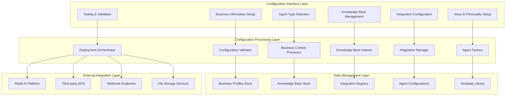

# Business Configuration Management Platform Design

## 📖 Overview

The Business Configuration Management Platform is the core system that enables businesses to configure AI agents with comprehensive business data, knowledge bases, method integrations, and webhook support. This platform serves as the foundation for creating intelligent, context-aware AI agents that can handle complex business operations.

## 🎯 Platform Objectives

### Primary Goals
1. **Streamline Agent Configuration**: Provide intuitive interfaces for setting up complex AI agents
2. **Enable Business Context Integration**: Allow deep integration of business data and processes
3. **Support Multi-Modal Operations**: Handle voice, text, and data interactions seamlessly
4. **Facilitate Knowledge Management**: Provide comprehensive knowledge base management
5. **Enable Extensibility**: Support custom integrations and webhook configurations

### Success Metrics
- **Configuration Completion Rate**: > 95% of users successfully configure their first agent
- **Time to Deployment**: < 30 minutes from start to operational agent
- **User Satisfaction**: > 4.5/5 rating for configuration experience
- **Feature Adoption**: > 80% utilization of advanced features within 30 days

## 🏗️ Platform Architecture

### Configuration Workflow Architecture



## 🎨 User Interface Design

### 1. Business Information Setup

#### Purpose
Capture comprehensive business information that provides context for AI agent operations.

#### Components
```typescript
interface BusinessInformationForm {
  businessProfile: {
    name: string;
    type: BusinessType;
    industry: string;
    description: string;
  };
  contactInformation: {
    address: Address;
    phone: string;
    email: string;
    website?: string;
  };
  operationalDetails: {
    timezone: string;
    businessHours: BusinessHours;
    serviceAreas: string[];
    languages: string[];
  };
  complianceInfo: {
    licenses: License[];
    certifications: Certification[];
    insuranceTypes: string[];
  };
}
```

#### Implementation Details
- **Progressive Disclosure**: Show relevant fields based on business type
- **Auto-completion**: Suggest values based on industry standards
- **Validation**: Real-time validation with helpful error messages
- **Import Capabilities**: Support importing from existing CRM systems

#### File Structure
```
src/components/configuration/
├── BusinessInformationForm.tsx          # Main form component
├── BusinessInformationHeader.tsx        # Header with progress indicator
├── BusinessInformationStep.tsx          # Step wrapper component
└── forms/
    ├── BusinessProfileForm.tsx          # Basic business details
    ├── ContactInformationForm.tsx       # Contact and location info
    ├── OperationalDetailsForm.tsx       # Hours, timezone, services
    └── ComplianceForm.tsx              # Licenses and certifications
```

### 2. AI Agent Configuration

#### Purpose
Configure multiple types of AI agents with specific capabilities and personalities.

#### Agent Types Configuration

##### Inbound Call Agent
```typescript
interface InboundCallAgentConfig {
  personality: 'professional' | 'friendly' | 'technical';
  capabilities: {
    callRouting: boolean;
    appointmentBooking: boolean;
    basicSupport: boolean;
    leadCapture: boolean;
  };
  callFlow: {
    greeting: string;
    routingRules: RoutingRule[];
    escalationTriggers: string[];
    transferProtocol: TransferProtocol;
  };
  voiceSettings: VoiceConfiguration;
}
```

##### Outbound Marketing Agent
```typescript
interface OutboundMarketingAgentConfig {
  personality: 'persuasive' | 'consultative' | 'informative';
  capabilities: {
    leadQualification: boolean;
    appointmentSetting: boolean;
    followUpCalls: boolean;
    surveyConduction: boolean;
  };
  campaignSettings: {
    callScript: string;
    objectives: string[];
    successMetrics: string[];
    complianceRules: ComplianceRule[];
  };
  voiceSettings: VoiceConfiguration;
}
```

##### Customer Support Agent
```typescript
interface CustomerSupportAgentConfig {
  personality: 'helpful' | 'technical' | 'empathetic';
  capabilities: {
    issueResolution: boolean;
    ticketCreation: boolean;
    knowledgeBaseSearch: boolean;
    escalationManagement: boolean;
  };
  supportFlow: {
    greeting: string;
    issueClassification: string[];
    resolutionSteps: ResolutionStep[];
    escalationCriteria: string[];
  };
  voiceSettings: VoiceConfiguration;
}
```

##### Appointment Follow-up Agent
```typescript
interface AppointmentFollowupAgentConfig {
  personality: 'friendly' | 'professional' | 'caring';
  capabilities: {
    appointmentConfirmation: boolean;
    rescheduling: boolean;
    reminderCalls: boolean;
    feedbackCollection: boolean;
  };
  followupFlow: {
    confirmationScript: string;
    rescheduleOptions: RescheduleOption[];
    reminderSchedule: ReminderSchedule;
    feedbackQuestions: string[];
  };
  voiceSettings: VoiceConfiguration;
}
```

#### Implementation Components
```
src/components/configuration/
├── AIAgentsStep.tsx                     # Main agent configuration
├── AgentTypeSelector.tsx                # Agent type selection
├── AgentConfigurationDashboard.tsx      # Agent management dashboard
├── VoiceSettingsPanel.tsx              # Voice and personality settings
├── CallScriptEditor.tsx                # Script editing interface
└── agent-configs/
    ├── InboundCallAgentConfig.tsx       # Inbound agent configuration
    ├── OutboundMarketingConfig.tsx      # Marketing agent configuration
    ├── CustomerSupportConfig.tsx        # Support agent configuration
    └── AppointmentFollowupConfig.tsx    # Follow-up agent configuration
```

### 3. Knowledge Base Management

#### Purpose
Provide comprehensive knowledge management capabilities for AI agents to access relevant business information.

#### Knowledge Base Structure
```typescript
interface KnowledgeBase {
  documents: {
    faqs: FAQDocument[];
    procedures: ProcedureDocument[];
    productInfo: ProductDocument[];
    policies: PolicyDocument[];
  };
  media: {
    images: MediaFile[];
    videos: MediaFile[];
    audio: MediaFile[];
  };
  integrations: {
    crmData: CRMIntegration;
    inventoryData: InventoryIntegration;
    calendarData: CalendarIntegration;
  };
  searchIndex: {
    keywords: string[];
    categories: string[];
    tags: string[];
  };
}
```

#### Document Management Features
- **File Upload**: Support for PDF, DOC, TXT, CSV files
- **Content Extraction**: Automatic text extraction and indexing
- **Categorization**: Automatic and manual content categorization
- **Version Control**: Document version management
- **Search Optimization**: Full-text search with relevance scoring

#### Implementation Components
```
src/components/configuration/
├── KnowledgeBaseManager.tsx             # Main knowledge base interface
├── DocumentUploader.tsx                 # File upload component
├── ContentCategorizer.tsx               # Content categorization
├── SearchIndexManager.tsx               # Search index management
└── knowledge-base/
    ├── DocumentLibrary.tsx              # Document browsing
    ├── FAQManager.tsx                   # FAQ management
    ├── ProcedureEditor.tsx              # Procedure documentation
    └── ProductCatalog.tsx               # Product information
```

### 4. Business Products and Services Configuration

#### Purpose
Configure comprehensive product and service information for AI agents to provide accurate information to customers.

#### Product Configuration
```typescript
interface ProductConfiguration {
  productCatalog: {
    categories: ProductCategory[];
    products: Product[];
    pricing: PricingStructure;
    inventory: InventoryInfo;
  };
  serviceOfferings: {
    services: Service[];
    appointmentTypes: AppointmentType[];
    staffAssignments: StaffAssignment[];
    scheduling: SchedulingRules;
  };
  businessRules: {
    availability: AvailabilityRules;
    pricing: PricingRules;
    discounts: DiscountRules;
    policies: BusinessPolicy[];
  };
}
```

#### Implementation Components
```
src/components/configuration/
├── BusinessProductsServices.tsx         # Main products/services interface
├── SimpleBusinessProductsServices.tsx   # Simplified interface
├── WorkingBusinessProductsServices.tsx  # Advanced interface
├── BusinessProducts.tsx                 # Product management
├── BusinessServices.tsx                 # Service management
└── products-services/
    ├── ProductCatalogManager.tsx        # Product catalog
    ├── ServiceConfigurationPanel.tsx    # Service setup
    ├── PricingManager.tsx               # Pricing configuration
    └── InventoryTracker.tsx             # Inventory management
```

### 5. Staff and Resource Management

#### Purpose
Configure staff information, schedules, and resource allocation for appointment booking and service delivery.

#### Staff Configuration
```typescript
interface StaffConfiguration {
  staffMembers: {
    personal: PersonalInfo;
    professional: ProfessionalInfo;
    schedule: Schedule;
    specialties: string[];
    availability: AvailabilityPattern;
  }[];
  resourceManagement: {
    rooms: Room[];
    equipment: Equipment[];
    calendars: CalendarIntegration[];
  };
  schedulingRules: {
    bufferTimes: BufferTime[];
    blockoutPeriods: BlockoutPeriod[];
    overtimeRules: OvertimeRule[];
  };
}
```

#### Implementation Components
```
src/components/configuration/
├── StaffManagement.tsx                  # Main staff management
├── ConsolidatedStaffManagement.tsx      # Consolidated interface
├── FinalStaffManagement.tsx             # Final staff setup
├── StaffCalendarConfiguration.tsx       # Calendar setup
└── staff/
    ├── StaffMemberForm.tsx              # Individual staff setup
    ├── ScheduleManager.tsx               # Schedule management
    ├── AvailabilityEditor.tsx            # Availability configuration
    └── ResourceAllocation.tsx            # Resource assignment
```

## 🔧 Configuration Processing Layer

### 1. Configuration Validator

#### Purpose
Ensure all configuration data is valid, complete, and consistent before agent deployment.

#### Validation Rules
```typescript
interface ValidationRules {
  businessProfile: {
    required: string[];
    formats: Record<string, RegExp>;
    businessLogic: ValidationRule[];
  };
  agentConfiguration: {
    personalityConsistency: ConsistencyRule[];
    capabilityDependencies: DependencyRule[];
    voiceSettingsValidation: VoiceValidationRule[];
  };
  knowledgeBase: {
    contentQuality: QualityRule[];
    searchOptimization: OptimizationRule[];
    accessPermissions: PermissionRule[];
  };
  integrations: {
    connectionValidation: ConnectionRule[];
    dataMapping: MappingRule[];
    securityCompliance: SecurityRule[];
  };
}
```

#### Implementation
```typescript
// src/lib/configuration/validator.ts
export class ConfigurationValidator {
  async validateBusinessProfile(profile: BusinessProfile): Promise<ValidationResult> {
    // Validate business profile completeness and accuracy
  }
  
  async validateAgentConfiguration(config: AgentConfiguration): Promise<ValidationResult> {
    // Validate agent configuration consistency
  }
  
  async validateKnowledgeBase(kb: KnowledgeBase): Promise<ValidationResult> {
    // Validate knowledge base content and structure
  }
  
  async validateIntegrations(integrations: Integration[]): Promise<ValidationResult> {
    // Validate external integrations
  }
}
```

### 2. Business Context Processor

#### Purpose
Process and optimize business context information for AI agent consumption.

#### Context Processing
```typescript
interface BusinessContextProcessor {
  processBusinessProfile(profile: BusinessProfile): ProcessedContext;
  generateContextPrompts(context: ProcessedContext): ContextPrompt[];
  optimizeForAgentType(context: ProcessedContext, agentType: AgentType): OptimizedContext;
  createVariableMapping(context: ProcessedContext): VariableMapping;
}
```

#### Implementation
```typescript
// src/lib/configuration/context-processor.ts
export class BusinessContextProcessor {
  async processBusinessProfile(profile: BusinessProfile): Promise<ProcessedContext> {
    // Process business information into agent-consumable format
    return {
      businessSummary: this.generateBusinessSummary(profile),
      serviceCapabilities: this.extractServiceCapabilities(profile),
      operationalContext: this.buildOperationalContext(profile),
      complianceRequirements: this.parseComplianceRequirements(profile)
    };
  }
  
  generateContextPrompts(context: ProcessedContext): ContextPrompt[] {
    // Generate context-aware prompts for different scenarios
  }
  
  optimizeForAgentType(context: ProcessedContext, agentType: AgentType): OptimizedContext {
    // Optimize context based on specific agent type requirements
  }
}
```

### 3. Knowledge Base Indexer

#### Purpose
Index and optimize knowledge base content for fast retrieval during AI agent operations.

#### Indexing Strategy
```typescript
interface KnowledgeIndexer {
  indexDocuments(documents: Document[]): IndexResult;
  createSearchableContent(content: string): SearchableContent;
  buildCategoryHierarchy(categories: Category[]): CategoryHierarchy;
  optimizeRetrievalPerformance(index: SearchIndex): OptimizedIndex;
}
```

#### Implementation
```typescript
// src/lib/configuration/knowledge-indexer.ts
export class KnowledgeIndexer {
  async indexDocuments(documents: Document[]): Promise<IndexResult> {
    // Create searchable index from documents
    const extractedContent = await this.extractContent(documents);
    const processedContent = await this.processContent(extractedContent);
    const searchIndex = await this.buildSearchIndex(processedContent);
    
    return {
      index: searchIndex,
      metadata: this.generateIndexMetadata(searchIndex),
      performance: this.calculatePerformanceMetrics(searchIndex)
    };
  }
  
  createSearchableContent(content: string): SearchableContent {
    // Process content for optimal search performance
  }
  
  buildCategoryHierarchy(categories: Category[]): CategoryHierarchy {
    // Build hierarchical category structure
  }
}
```

## 🔌 Integration Management

### 1. Webhook Configuration

#### Purpose
Configure webhook endpoints for real-time integration with external systems.

#### Webhook Types
```typescript
interface WebhookConfiguration {
  callEvents: {
    callStarted: WebhookEndpoint;
    callEnded: WebhookEndpoint;
    callTransferred: WebhookEndpoint;
    callFailed: WebhookEndpoint;
  };
  businessEvents: {
    appointmentBooked: WebhookEndpoint;
    appointmentCancelled: WebhookEndpoint;
    leadCaptured: WebhookEndpoint;
    supportTicketCreated: WebhookEndpoint;
  };
  systemEvents: {
    agentDeployed: WebhookEndpoint;
    configurationUpdated: WebhookEndpoint;
    errorOccurred: WebhookEndpoint;
  };
}
```

#### Webhook Security
```typescript
interface WebhookSecurity {
  authentication: {
    method: 'signature' | 'token' | 'oauth';
    secretKey: string;
    headers: Record<string, string>;
  };
  validation: {
    ipWhitelist: string[];
    rateLimiting: RateLimitConfig;
    payloadValidation: ValidationSchema;
  };
  retry: {
    maxAttempts: number;
    backoffStrategy: 'linear' | 'exponential';
    timeouts: number[];
  };
}
```

### 2. API Integration Management

#### Purpose
Manage connections to external APIs for data retrieval and system integration.

#### Integration Types
```typescript
interface APIIntegrations {
  crm: {
    provider: 'salesforce' | 'hubspot' | 'pipedrive' | 'custom';
    connection: ConnectionConfig;
    dataMapping: DataMapping;
    syncSettings: SyncSettings;
  };
  calendar: {
    provider: 'google' | 'outlook' | 'caldav' | 'custom';
    connection: ConnectionConfig;
    availabilitySync: AvailabilitySync;
    bookingRules: BookingRules;
  };
  payment: {
    provider: 'stripe' | 'paypal' | 'square' | 'custom';
    connection: ConnectionConfig;
    paymentMethods: PaymentMethod[];
    billingRules: BillingRules;
  };
  communication: {
    email: EmailIntegration;
    sms: SMSIntegration;
    chat: ChatIntegration;
  };
}
```

### 3. Method Call Configuration

#### Purpose
Configure callable methods that AI agents can invoke during conversations.

#### Method Types
```typescript
interface MethodConfiguration {
  dataRetrieval: {
    customerLookup: MethodDefinition;
    productSearch: MethodDefinition;
    appointmentCheck: MethodDefinition;
    inventoryCheck: MethodDefinition;
  };
  actions: {
    bookAppointment: MethodDefinition;
    sendEmail: MethodDefinition;
    createTicket: MethodDefinition;
    processPayment: MethodDefinition;
  };
  calculations: {
    priceCalculation: MethodDefinition;
    availabilityCheck: MethodDefinition;
    distanceCalculation: MethodDefinition;
    timeConversion: MethodDefinition;
  };
  integrations: {
    crmUpdate: MethodDefinition;
    calendarSync: MethodDefinition;
    inventoryUpdate: MethodDefinition;
    notificationSend: MethodDefinition;
  };
}
```

#### Method Security and Validation
```typescript
interface MethodSecurity {
  authentication: AuthenticationRequirement;
  authorization: AuthorizationRule[];
  inputValidation: ValidationSchema;
  outputSanitization: SanitizationRule[];
  rateLimiting: RateLimitConfig;
  auditLogging: AuditConfig;
}
```

## 🚀 Deployment and Orchestration

### 1. Agent Factory

#### Purpose
Create and deploy AI agents based on configuration specifications.

#### Factory Implementation
```typescript
// src/lib/agent-factory.ts
export class AgentFactory {
  async createAgent(config: AgentConfiguration): Promise<Agent> {
    // Validate configuration
    const validationResult = await this.validateConfiguration(config);
    if (!validationResult.isValid) {
      throw new ConfigurationError(validationResult.errors);
    }
    
    // Process business context
    const processedContext = await this.processBusinessContext(config.businessContext);
    
    // Generate agent prompts
    const prompts = await this.generateAgentPrompts(config, processedContext);
    
    // Configure voice settings
    const voiceConfig = await this.optimizeVoiceSettings(config.voiceSettings);
    
    // Set up integrations
    const integrations = await this.configureIntegrations(config.integrations);
    
    // Deploy to Retell AI
    const deploymentResult = await this.deployToRetellAI({
      prompts,
      voiceConfig,
      integrations
    });
    
    return this.createAgentInstance(deploymentResult);
  }
  
  async deployToRetellAI(config: DeploymentConfig): Promise<DeploymentResult> {
    // Deploy agent to Retell AI platform
  }
  
  async updateAgent(agentId: string, updates: Partial<AgentConfiguration>): Promise<UpdateResult> {
    // Update existing agent configuration
  }
}
```

### 2. Configuration Templates

#### Purpose
Provide pre-built configuration templates for common business types and use cases.

#### Template Structure
```typescript
interface ConfigurationTemplate {
  metadata: {
    id: string;
    name: string;
    description: string;
    businessType: string;
    industry: string;
    complexity: 'basic' | 'intermediate' | 'advanced';
  };
  businessProfile: Partial<BusinessProfile>;
  agentConfigurations: Partial<AgentConfiguration>[];
  knowledgeBase: Partial<KnowledgeBase>;
  integrations: Partial<Integration>[];
  customizations: CustomizationOption[];
}
```

#### Pre-built Templates
- **Healthcare Clinic**: Medical appointment booking, patient support
- **Legal Office**: Client consultation scheduling, case inquiry handling
- **Retail Business**: Product inquiries, order support, appointment booking
- **Service Provider**: Service booking, quote requests, customer support
- **Restaurant**: Reservation management, catering inquiries, delivery support
- **Real Estate**: Property inquiries, showing appointments, client support

## 📊 Configuration Analytics

### 1. Configuration Metrics

#### Purpose
Track configuration success rates, user behavior, and optimization opportunities.

#### Metrics Collection
```typescript
interface ConfigurationMetrics {
  completionRates: {
    businessProfileCompletion: number;
    agentConfigurationCompletion: number;
    knowledgeBaseSetup: number;
    integrationConfiguration: number;
  };
  userBehavior: {
    timeToComplete: number;
    commonDropOffPoints: string[];
    mostUsedFeatures: string[];
    helpRequestFrequency: number;
  };
  performanceMetrics: {
    agentDeploymentTime: number;
    configurationValidationTime: number;
    errorRates: Record<string, number>;
  };
}
```

### 2. Optimization Recommendations

#### Purpose
Provide intelligent recommendations for improving configuration and agent performance.

#### Recommendation Engine
```typescript
interface RecommendationEngine {
  analyzeConfiguration(config: AgentConfiguration): ConfigurationAnalysis;
  generateOptimizationSuggestions(analysis: ConfigurationAnalysis): OptimizationSuggestion[];
  predictPerformanceImpact(suggestions: OptimizationSuggestion[]): PerformanceImpact;
  trackImplementationSuccess(suggestions: OptimizationSuggestion[]): ImplementationResult;
}
```

## 🔐 Security and Compliance

### 1. Data Protection

#### Purpose
Ensure all business data and configurations are properly protected and compliant with regulations.

#### Security Measures
- **Encryption**: All sensitive data encrypted at rest and in transit
- **Access Control**: Role-based access with principle of least privilege
- **Audit Logging**: Comprehensive logging of all configuration changes
- **Data Anonymization**: PII protection in development and testing environments

### 2. Compliance Management

#### Purpose
Ensure compliance with industry regulations and standards.

#### Compliance Framework
```typescript
interface ComplianceFramework {
  regulations: {
    gdpr: GDPRCompliance;
    hipaa: HIPAACompliance;
    sox: SOXCompliance;
    pci: PCICompliance;
  };
  dataRetention: DataRetentionPolicy;
  rightToForget: ForgettenDataProcess;
  consentManagement: ConsentManagement;
  auditTrails: AuditTrailConfig;
}
```

## 🎯 Success Metrics and KPIs

### Configuration Platform Metrics
- **User Onboarding Success Rate**: > 95%
- **Configuration Completion Time**: < 30 minutes average
- **Agent Deployment Success Rate**: > 99%
- **User Satisfaction Score**: > 4.5/5
- **Feature Adoption Rate**: > 80% within 30 days
- **Configuration Error Rate**: < 2%

### Business Impact Metrics
- **Time to Value**: < 2 hours from signup to first successful call
- **Agent Performance**: > 85% call success rate
- **Cost Reduction**: > 40% reduction in setup time vs manual configuration
- **Scalability**: Support for 1000+ concurrent agent configurations

This comprehensive design provides the foundation for a powerful, user-friendly business configuration platform that enables businesses to quickly and effectively deploy AI agents tailored to their specific needs and requirements.