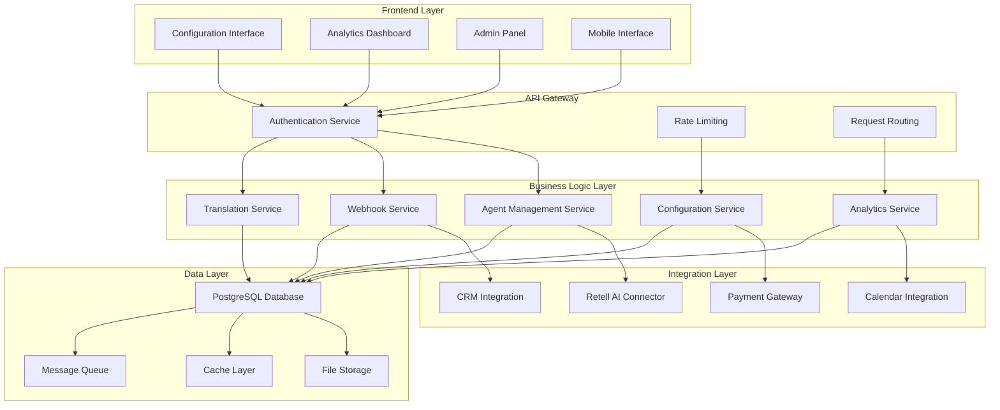
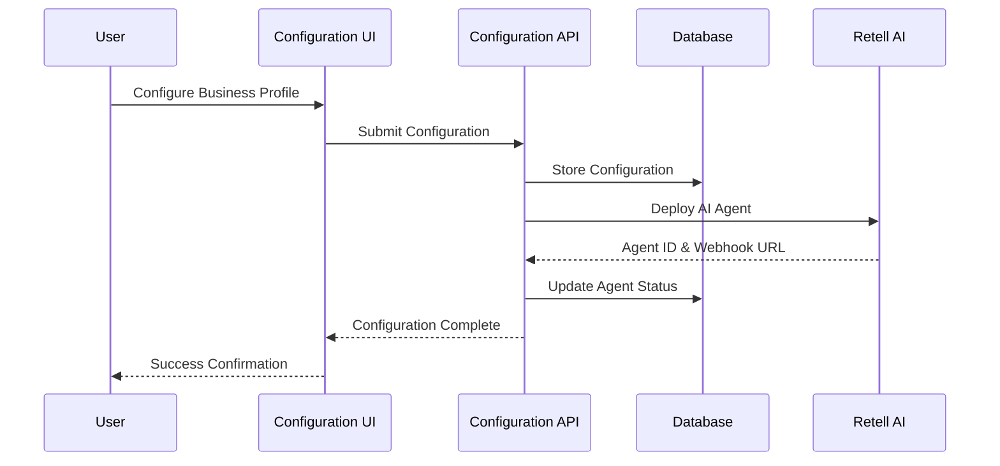
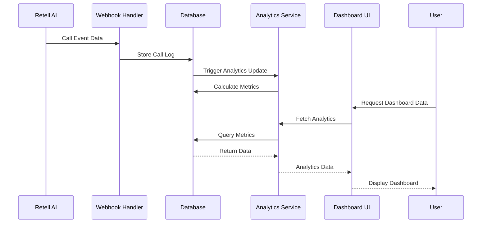

# System Architecture Overview

## 📖 Executive Summary

The Call Center Automation Platform is a comprehensive AI-powered solution designed to streamline business communications through intelligent agent management and data analytics. The platform serves dual purposes: providing businesses with powerful configuration tools for AI agents and offering users comprehensive analytics and monitoring capabilities.

## 🎯 System Objectives

### Primary Objective 1: Business Configuration Management Platform
Enable businesses to configure and manage AI agents with comprehensive business data, knowledge bases, method integrations, and webhook support.

### Primary Objective 2: User Query and Analytics Platform  
Provide users with advanced query capabilities for usage logs, comprehensive reporting, analytics dashboards, and payment management.

## 🏗️ High-Level Architecture



## 🎨 System Components

### 1. Configuration Management Platform

#### Core Features
- **Business Profile Management**: Company information, contact details, service offerings
- **AI Agent Configuration**: Multi-type agent setup (Inbound, Outbound Marketing, Support, Appointment Follow-up)
- **Knowledge Base Management**: Document upload, FAQ management, product information
- **Integration Management**: API connections, webhook configurations, third-party services
- **Multi-language Support**: Automatic agent translation and localization

#### Key Components
```
src/app/configuration/
├── page.tsx                    # Main configuration interface
├── BusinessInformationStep.tsx # Business setup wizard
├── AIAgentsStep.tsx           # Agent configuration
├── WorkingBusinessProductsServices.tsx # Service management
└── VoiceSettingsPanel.tsx     # Voice customization
```

### 2. User Query and Analytics Platform

#### Core Features
- **Call Log Management**: Real-time call monitoring, transcript analysis
- **Usage Analytics**: Performance metrics, success rates, language distribution
- **Reporting System**: Custom reports, data export, trend analysis
- **User Management**: Account management, permissions, usage tracking
- **Payment Integration**: Billing management, tier upgrades, usage monitoring

#### Key Components
```
src/app/dashboard/
├── page.tsx              # Main analytics dashboard
├── StatsCard.tsx         # Performance metrics display
└── CallLogsTable.tsx     # Call history interface

src/components/tables/
├── CallLogsTable.tsx     # Advanced call log filtering
├── Pagination.tsx        # Data pagination
└── SearchFilters.tsx     # Search and filter tools
```

## 🔧 Technical Architecture

### Frontend Architecture (Next.js 15 + React 19)

#### Application Structure
```
src/
├── app/                    # Next.js App Router
│   ├── admin/             # Admin interface
│   ├── ai-agents/         # Agent management
│   ├── configuration/     # Business configuration
│   ├── dashboard/         # Analytics dashboard
│   ├── settings/          # User preferences
│   └── api/              # API route handlers
├── components/            # Reusable UI components
├── lib/                  # Utility libraries
├── hooks/                # Custom React hooks
├── stores/               # State management
└── types/                # TypeScript definitions
```

#### Key Technologies
- **Framework**: Next.js 15 with App Router
- **UI Library**: React 19 with Radix UI components
- **Styling**: Tailwind CSS 4.0
- **State Management**: Zustand for client state
- **Authentication**: JWT with Supabase Auth
- **Internationalization**: next-intl for multi-language support

### Backend Architecture

#### Service Layer Design
```
src/lib/services/
├── base-service.ts        # Abstract base service
├── business-registry.ts   # Business management
├── clinic-service.ts      # Healthcare specialization
├── patient-service.ts     # Patient data management
└── metadata-service.ts    # System metadata
```

#### Core Libraries
```
src/lib/
├── agent-factory.ts       # AI agent creation patterns
├── translation-manager.ts # Multi-language support
├── webhook-validation.ts  # Security validation
├── interceptors/         # Request/response middleware
└── message-system/       # Event-driven messaging
```

### Database Architecture (Supabase PostgreSQL)

#### Core Tables (45 total)
- **User Management**: `profiles`, `admin_users`
- **Business Configuration**: `business_profiles`, `business_services`, `business_products`
- **AI Agent Management**: `ai_agents`, `agent_configurations`, `agent_types`
- **Analytics & Logging**: `customer_call_logs`, `agent_metrics`, `ai_call_logs`
- **Appointment System**: `appointments`, `appointment_types`, `staff_members`
- **Multi-language**: `supported_languages`, `agent_translations`

#### Security Features
- **Row-Level Security (RLS)**: User-specific data access
- **JWT Authentication**: Secure token-based access
- **Role-Based Access Control**: Admin, user, super-admin roles
- **Data Encryption**: Sensitive information protection

## 🌐 Integration Architecture

### External Service Integrations

#### Retell AI Platform
- **Agent Deployment**: Automatic AI agent provisioning
- **Voice Configuration**: Voice settings synchronization
- **Call Routing**: Intelligent call distribution
- **Webhook Management**: Real-time event handling

#### Translation Services
- **Google Translate API**: Text translation services
- **AWS Translate**: Alternative translation provider
- **Language Detection**: Automatic language identification
- **Quality Scoring**: Translation accuracy assessment

#### Calendar Integrations
- **Google Calendar**: Appointment synchronization
- **Office 365**: Enterprise calendar support
- **Cal.com**: Open-source booking integration
- **Calendly**: Popular scheduling platform

#### Payment Processing
- **Stripe Integration**: Payment processing
- **Usage Tracking**: Real-time usage monitoring
- **Tier Management**: Subscription tier handling
- **Billing Automation**: Automated invoice generation

## 📊 Data Flow Architecture

### Configuration Flow


### Analytics Flow


## 🔐 Security Architecture

### Authentication & Authorization
- **Multi-Factor Authentication**: Enhanced security for admin accounts
- **JWT Token Management**: Secure session handling with refresh tokens
- **Role-Based Permissions**: Granular access control system
- **API Rate Limiting**: Protection against abuse and DOS attacks

### Data Protection
- **Encryption at Rest**: Database encryption for sensitive data
- **Encryption in Transit**: TLS/SSL for all communications
- **Input Validation**: Comprehensive sanitization and validation
- **SQL Injection Prevention**: Parameterized queries and ORM protection

### Compliance & Privacy
- **GDPR Compliance**: Data privacy controls and user rights
- **HIPAA Considerations**: Healthcare data protection (when applicable)
- **Audit Logging**: Comprehensive activity tracking
- **Data Retention Policies**: Automated data lifecycle management

## 🚀 Performance & Scalability

### Performance Optimization
- **Database Indexing**: Optimized queries for large datasets
- **Caching Strategy**: Redis for frequently accessed data
- **CDN Integration**: Global content delivery optimization
- **Image Optimization**: Next.js automatic image optimization

### Scalability Design
- **Horizontal Scaling**: Load balancer configuration
- **Database Sharding**: Data distribution strategies
- **Microservices Ready**: Modular architecture for service separation
- **Queue Management**: Background job processing with Bull/BullMQ

## 📈 Monitoring & Analytics

### Application Monitoring
- **Real-time Metrics**: System performance tracking
- **Error Tracking**: Automatic error detection and reporting
- **Performance Monitoring**: Response time and throughput analysis
- **User Analytics**: Usage patterns and behavior tracking

### Business Intelligence
- **Custom Dashboards**: Configurable analytics views
- **Report Generation**: Automated reporting system
- **Data Export**: Multiple format support (CSV, PDF, Excel)
- **Trend Analysis**: Historical data pattern recognition

## 🔄 Development & Deployment

### Development Workflow
- **Environment Management**: Development, staging, production environments
- **CI/CD Pipeline**: Automated testing and deployment
- **Code Quality**: ESLint, Prettier, TypeScript strict mode
- **Testing Strategy**: Unit tests, integration tests, E2E tests

### Deployment Architecture
- **Container Strategy**: Docker containerization
- **Cloud Deployment**: Vercel for frontend, Supabase for backend
- **Environment Variables**: Secure configuration management
- **Database Migrations**: Version-controlled schema changes

## 🎯 Success Metrics

### Performance Targets
- **Page Load Time**: < 2 seconds for dashboard pages
- **API Response Time**: < 200ms for standard operations
- **Database Query Time**: < 100ms for complex queries
- **Agent Deployment Time**: < 30 seconds end-to-end

### Business Metrics
- **User Adoption Rate**: > 90% successful onboarding
- **Feature Usage**: > 80% multi-language agent utilization
- **Customer Satisfaction**: > 4.5/5 user rating
- **System Uptime**: > 99.9% availability

## 🔮 Future Roadmap

### Phase 1 Enhancements (3-6 months)
- **Advanced Analytics**: Predictive analytics and insights
- **API Marketplace**: Third-party integration ecosystem
- **Mobile App**: Native mobile application
- **Voice Cloning**: Custom voice generation capabilities

### Phase 2 Expansion (6-12 months)
- **Multi-tenant Architecture**: Enterprise customer support
- **Advanced AI Features**: GPT-4 integration and custom models
- **Global Expansion**: Additional language and region support
- **Enterprise Features**: SSO, advanced security, compliance tools

### Phase 3 Innovation (12+ months)
- **AI-Powered Optimization**: Automatic performance improvements
- **Blockchain Integration**: Decentralized identity and payments
- **IoT Integration**: Smart device connectivity
- **Advanced Automation**: Workflow automation and orchestration

---

## 📋 Implementation Status

### Current Status: 85% Complete
- ✅ Core database architecture implemented
- ✅ AI agent management system operational
- ✅ Multi-language support functional
- ✅ Configuration interface completed
- ✅ Basic analytics dashboard implemented
- 🔄 Advanced reporting in progress
- 📋 Payment integration planned
- 📋 Advanced security features planned

### Immediate Next Steps
1. Complete advanced analytics implementation
2. Integrate payment processing system
3. Enhance security and compliance features
4. Optimize performance and scalability
5. Conduct comprehensive testing and quality assurance

This architecture provides a solid foundation for a scalable, secure, and feature-rich call center automation platform that serves both business configuration needs and comprehensive analytics requirements.