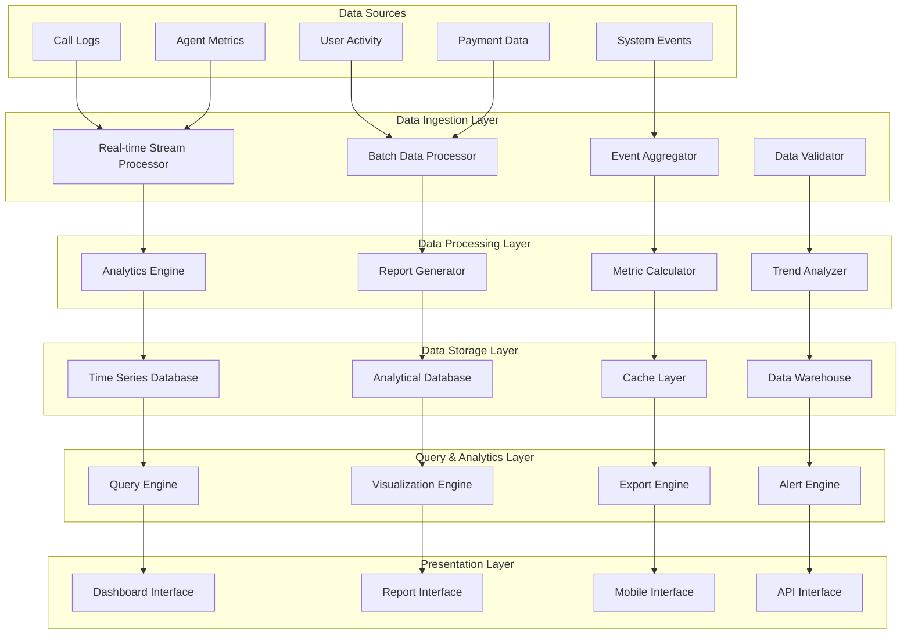

# User Query and Analytics Platform Design

## 📖 Overview

The User Query and Analytics Platform provides comprehensive capabilities for querying usage logs, generating reports, analyzing performance metrics, and managing payment systems. This platform serves as the intelligence layer of the call center automation system, offering deep insights into agent performance, customer interactions, and business outcomes.

## 🎯 Platform Objectives

### Primary Goals
1. **Comprehensive Data Access**: Provide powerful query capabilities for all system data
2. **Advanced Analytics**: Offer sophisticated analysis tools and visualizations
3. **Real-time Monitoring**: Enable live monitoring of system performance and agent activities
4. **Business Intelligence**: Transform raw data into actionable business insights
5. **Cost Management**: Provide transparent usage tracking and billing management

### Success Metrics
- **Query Response Time**: < 2 seconds for standard queries
- **Dashboard Load Time**: < 3 seconds for complex dashboards
- **Data Accuracy**: 99.9% accuracy in reporting metrics
- **User Adoption**: > 90% of users actively using analytics features
- **Cost Transparency**: 100% visibility into usage-based billing

## 🏗️ Platform Architecture

### Analytics Data Flow Architecture



## 🎨 User Interface Design

### 1. Analytics Dashboard

#### Purpose
Provide a comprehensive overview of system performance, agent activities, and business metrics in real-time.

#### Dashboard Components
```typescript
interface AnalyticsDashboard {
  overview: {
    keyMetrics: KeyMetric[];
    performanceIndicators: PerformanceIndicator[];
    trendCharts: TrendChart[];
    alertsPanel: Alert[];
  };
  realTimeMetrics: {
    activeAgents: number;
    currentCalls: number;
    queueStatus: QueueStatus;
    systemHealth: SystemHealth;
  };
  historicalAnalytics: {
    callVolumeHistory: CallVolumeData[];
    performanceTrends: PerformanceTrend[];
    userEngagementMetrics: EngagementMetric[];
    costAnalysis: CostAnalysis;
  };
  customizableWidgets: {
    widgets: Widget[];
    layouts: Layout[];
    preferences: UserPreference[];
  };
}
```

#### Key Metrics Display
- **Call Performance**: Success rates, average duration, customer satisfaction
- **Agent Performance**: Utilization rates, response times, resolution rates
- **Business Impact**: Lead conversion, appointment bookings, revenue impact
- **System Health**: Uptime, error rates, response times

#### Implementation Components
```
src/components/dashboard/
├── AnalyticsDashboard.tsx               # Main dashboard component
├── StatsCard.tsx                        # Metric display cards
├── PerformanceCharts.tsx                # Chart components
├── RealTimeMonitor.tsx                  # Real-time data display
├── CustomizableWidget.tsx               # Configurable widgets
└── widgets/
    ├── CallVolumeWidget.tsx             # Call volume visualization
    ├── AgentPerformanceWidget.tsx       # Agent performance metrics
    ├── CostAnalysisWidget.tsx           # Cost and billing analysis
    └── AlertsWidget.tsx                 # System alerts and notifications
```

### 2. Call Logs Query Interface

#### Purpose
Provide advanced search, filtering, and analysis capabilities for call logs and transcripts.

#### Query Interface Features
```typescript
interface CallLogsInterface {
  searchCapabilities: {
    fullTextSearch: boolean;
    advancedFiltering: FilterOption[];
    dateRangeSelection: DateRange;
    multiCriteriaSearch: SearchCriteria[];
  };
  dataVisualization: {
    callTimeline: TimelineView;
    conversationFlow: FlowDiagram;
    sentimentAnalysis: SentimentVisualization;
    keywordClouds: WordCloud;
  };
  exportOptions: {
    formats: ExportFormat[];
    customization: ExportCustomization;
    scheduling: ScheduledExport[];
    automation: AutomatedExport[];
  };
  analyticalTools: {
    trendAnalysis: TrendAnalysis;
    comparativeAnalysis: ComparisonTool;
    patternRecognition: PatternDetection;
    anomalyDetection: AnomalyAlert[];
  };
}
```

#### Advanced Filtering Options
- **Time-based Filters**: Specific dates, time ranges, recurring periods
- **Agent Filters**: Specific agents, agent types, performance ranges
- **Call Characteristics**: Duration, outcome, language, sentiment
- **Business Context**: Customer type, service category, appointment status
- **Technical Filters**: Call quality, error codes, integration status

#### Implementation Components
```
src/components/tables/
├── CallLogsTable.tsx                    # Main call logs interface
├── AdvancedSearchPanel.tsx              # Search and filter controls
├── CallDetailsModal.tsx                 # Detailed call information
├── TranscriptViewer.tsx                 # Conversation transcript display
├── ExportManager.tsx                    # Data export functionality
└── filters/
    ├── DateRangeFilter.tsx              # Date/time filtering
    ├── AgentFilter.tsx                  # Agent-specific filtering
    ├── PerformanceFilter.tsx            # Performance-based filtering
    └── CustomFilter.tsx                 # User-defined filters
```

### 3. Reports and Analytics

#### Purpose
Generate comprehensive reports and provide deep analytical insights into system performance and business outcomes.

#### Report Types
```typescript
interface ReportingSystem {
  operationalReports: {
    dailySummary: DailySummaryReport;
    weeklyPerformance: WeeklyPerformanceReport;
    monthlyAnalytics: MonthlyAnalyticsReport;
    quarterlyReview: QuarterlyReviewReport;
  };
  businessReports: {
    revenueImpact: RevenueImpactReport;
    customerSatisfaction: CustomerSatisfactionReport;
    leadGeneration: LeadGenerationReport;
    appointmentAnalytics: AppointmentAnalyticsReport;
  };
  technicalReports: {
    systemPerformance: SystemPerformanceReport;
    errorAnalysis: ErrorAnalysisReport;
    integrationHealth: IntegrationHealthReport;
    securityAudit: SecurityAuditReport;
  };
  customReports: {
    reportBuilder: ReportBuilder;
    savedReports: SavedReport[];
    scheduledReports: ScheduledReport[];
    sharedReports: SharedReport[];
  };
}
```

#### Report Generation Features
- **Interactive Dashboards**: Drill-down capabilities, dynamic filtering
- **Automated Scheduling**: Daily, weekly, monthly report generation
- **Multi-format Export**: PDF, Excel, CSV, PowerPoint formats
- **Collaborative Features**: Report sharing, commenting, annotation
- **Version Control**: Report history, change tracking, rollback capabilities

### 4. Usage and Billing Analytics

#### Purpose
Provide transparent visibility into usage patterns, costs, and billing information.

#### Billing Dashboard
```typescript
interface BillingDashboard {
  usageMetrics: {
    callMinutes: UsageMetric;
    apiCalls: UsageMetric;
    storageUsage: UsageMetric;
    additionalFeatures: UsageMetric[];
  };
  costAnalysis: {
    currentPeriodCost: Cost;
    costBreakdown: CostBreakdown;
    projectedCosts: CostProjection;
    costTrends: CostTrend[];
  };
  billingManagement: {
    invoiceHistory: Invoice[];
    paymentMethods: PaymentMethod[];
    billingContacts: BillingContact[];
    autoPaySettings: AutoPaySettings;
  };
  costOptimization: {
    recommendations: OptimizationRecommendation[];
    potentialSavings: SavingsOpportunity[];
    usageOptimization: UsageOptimization;
    tierComparison: TierComparison;
  };
}
```

#### Implementation Components
```
src/components/billing/
├── BillingDashboard.tsx                 # Main billing interface
├── UsageMetrics.tsx                     # Usage tracking display
├── CostAnalysis.tsx                     # Cost breakdown and analysis
├── InvoiceManager.tsx                   # Invoice management
├── PaymentMethods.tsx                   # Payment method management
└── optimization/
    ├── CostOptimizer.tsx                # Cost optimization recommendations
    ├── UsageAnalyzer.tsx                # Usage pattern analysis
    ├── TierComparison.tsx               # Pricing tier comparison
    └── SavingsCalculator.tsx            # Potential savings calculator
```

## 🔍 Query Engine Architecture

### 1. Real-time Query Processing

#### Purpose
Provide fast, real-time query capabilities for live data monitoring and immediate insights.

#### Query Engine Implementation
```typescript
interface QueryEngine {
  realtimeProcessor: {
    streamProcessing: StreamProcessor;
    liveAggregation: LiveAggregator;
    instantMetrics: MetricsCalculator;
    alertGeneration: AlertGenerator;
  };
  batchProcessor: {
    historicalAnalysis: HistoricalAnalyzer;
    trendCalculation: TrendCalculator;
    patternRecognition: PatternRecognizer;
    reportGeneration: ReportGenerator;
  };
  queryOptimization: {
    indexManagement: IndexManager;
    cacheStrategy: CacheStrategy;
    queryPlanning: QueryPlanner;
    performanceMonitoring: PerformanceMonitor;
  };
}
```

#### Query Types and Optimization
- **Real-time Queries**: Current metrics, live dashboards, instant alerts
- **Historical Queries**: Trend analysis, comparative studies, long-term patterns
- **Complex Aggregations**: Multi-dimensional analysis, cross-referencing
- **Predictive Queries**: Forecasting, trend projection, anomaly prediction

### 2. Data Aggregation and Processing

#### Purpose
Efficiently process and aggregate large volumes of data for analytical purposes.

#### Aggregation Strategies
```typescript
interface DataAggregation {
  timeBasedAggregation: {
    realTime: RealTimeAggregator;
    minutely: MinutelyAggregator;
    hourly: HourlyAggregator;
    daily: DailyAggregator;
    weekly: WeeklyAggregator;
    monthly: MonthlyAggregator;
  };
  dimensionalAggregation: {
    agentPerformance: AgentAggregator;
    customerSegmentation: CustomerAggregator;
    businessMetrics: BusinessAggregator;
    technicalMetrics: TechnicalAggregator;
  };
  computedMetrics: {
    kpiCalculation: KPICalculator;
    trendAnalysis: TrendAnalyzer;
    performanceScoring: PerformanceScorer;
    predictiveMetrics: PredictiveAnalyzer;
  };
}
```

#### Processing Pipeline
```typescript
// src/lib/analytics/data-processor.ts
export class DataProcessor {
  async processCallLog(callLog: CallLog): Promise<ProcessedCallData> {
    // Process raw call log data
    const basicMetrics = this.calculateBasicMetrics(callLog);
    const sentimentAnalysis = await this.analyzeSentiment(callLog.transcript);
    const keywordExtraction = this.extractKeywords(callLog.transcript);
    const performanceMetrics = this.calculatePerformanceMetrics(callLog);
    
    return {
      ...basicMetrics,
      sentiment: sentimentAnalysis,
      keywords: keywordExtraction,
      performance: performanceMetrics,
      processedAt: new Date()
    };
  }
  
  async aggregateMetrics(timeRange: TimeRange, dimensions: string[]): Promise<AggregatedMetrics> {
    // Aggregate metrics across time and dimensions
  }
  
  async detectAnomalies(metrics: Metric[], threshold: number): Promise<Anomaly[]> {
    // Detect anomalies in metric patterns
  }
}
```

## 📊 Advanced Analytics Features

### 1. Predictive Analytics

#### Purpose
Provide predictive insights for proactive decision-making and optimization.

#### Predictive Models
```typescript
interface PredictiveAnalytics {
  callVolumeForecasting: {
    model: ForecastingModel;
    predictions: VolumePredicition[];
    accuracy: AccuracyMetrics;
    confidenceIntervals: ConfidenceInterval[];
  };
  performancePrediction: {
    agentPerformance: PerformancePrediction;
    systemLoad: LoadPrediction;
    costProjection: CostPrediction;
    demandForecasting: DemandForecast;
  };
  anomalyPrediction: {
    earlyWarningSystem: EarlyWarningSystem;
    riskAssessment: RiskAssessment;
    preventiveAlerts: PreventiveAlert[];
    mitigation: MitigationStrategy[];
  };
  businessIntelligence: {
    revenueForecasting: RevenueForecast;
    customerBehavior: BehaviorPrediction;
    marketTrends: TrendPrediction;
    competitiveAnalysis: CompetitiveInsight[];
  };
}
```

### 2. Machine Learning Integration

#### Purpose
Leverage machine learning algorithms for advanced pattern recognition and insights.

#### ML Capabilities
```typescript
interface MachineLearningIntegration {
  naturalLanguageProcessing: {
    sentimentAnalysis: SentimentAnalyzer;
    intentRecognition: IntentRecognizer;
    topicModeling: TopicModeler;
    conversationAnalysis: ConversationAnalyzer;
  };
  performanceOptimization: {
    agentRecommendations: AgentOptimizer;
    scriptOptimization: ScriptOptimizer;
    routingOptimization: RoutingOptimizer;
    resourceOptimization: ResourceOptimizer;
  };
  customerInsights: {
    segmentation: CustomerSegmentation;
    lifetimeValue: LTVPredictor;
    churnPrediction: ChurnPredictor;
    satisfactionScoring: SatisfactionPredictor;
  };
  businessIntelligence: {
    demandPrediction: DemandPredictor;
    priceOptimization: PriceOptimizer;
    marketAnalysis: MarketAnalyzer;
    competitorAnalysis: CompetitorAnalyzer;
  };
}
```

### 3. Real-time Monitoring and Alerting

#### Purpose
Provide continuous monitoring with intelligent alerting for proactive issue resolution.

#### Monitoring System
```typescript
interface MonitoringSystem {
  realTimeMetrics: {
    systemHealth: HealthMonitor;
    performanceMetrics: PerformanceMonitor;
    errorTracking: ErrorTracker;
    usageMonitoring: UsageMonitor;
  };
  alertingSystem: {
    thresholdAlerts: ThresholdAlertManager;
    anomalyAlerts: AnomalyAlertManager;
    predictiveAlerts: PredictiveAlertManager;
    customAlerts: CustomAlertManager;
  };
  notificationChannels: {
    email: EmailNotifier;
    sms: SMSNotifier;
    slack: SlackNotifier;
    webhook: WebhookNotifier;
  };
  escalationProcedures: {
    alertEscalation: EscalationManager;
    incidentManagement: IncidentManager;
    responseAutomation: AutomatedResponse;
    recoveryProcedures: RecoveryManager;
  };
}
```

## 🔧 Data Management Architecture

### 1. Data Storage Strategy

#### Purpose
Implement efficient data storage strategies optimized for different types of analytics workloads.

#### Storage Architecture
```typescript
interface StorageArchitecture {
  hotStorage: {
    realTimeData: RealtimeStorage;
    frequentAccess: FrequentAccessStorage;
    cacheLayers: CacheLayer[];
  };
  warmStorage: {
    historicalData: HistoricalStorage;
    analyticalData: AnalyticalStorage;
    aggregatedData: AggregatedStorage;
  };
  coldStorage: {
    archivalData: ArchivalStorage;
    complianceData: ComplianceStorage;
    backupData: BackupStorage;
  };
  dataLifecycle: {
    retentionPolicies: RetentionPolicy[];
    archivalProcedures: ArchivalProcedure[];
    deletionPolicies: DeletionPolicy[];
  };
}
```

### 2. Data Quality Management

#### Purpose
Ensure high data quality through validation, cleaning, and enrichment processes.

#### Quality Management
```typescript
interface DataQualityManagement {
  validation: {
    schemaValidation: SchemaValidator;
    dataIntegrityChecks: IntegrityChecker;
    consistencyValidation: ConsistencyValidator;
    completenessChecks: CompletenessChecker;
  };
  cleaning: {
    duplicateRemoval: DuplicateRemover;
    outlierDetection: OutlierDetector;
    missingDataHandler: MissingDataHandler;
    normalization: DataNormalizer;
  };
  enrichment: {
    contextEnrichment: ContextEnricher;
    derivedMetrics: DerivedMetricsCalculator;
    externalDataIntegration: ExternalDataIntegrator;
    semanticEnrichment: SemanticEnricher;
  };
  monitoring: {
    qualityMetrics: QualityMetricsCalculator;
    qualityReports: QualityReporter;
    alerting: QualityAlertManager;
    improvementTracking: ImprovementTracker;
  };
}
```

## 🎛️ User Management and Permissions

### 1. Role-based Access Control

#### Purpose
Implement comprehensive access control for different user roles and permissions.

#### Access Control System
```typescript
interface AccessControlSystem {
  roles: {
    superAdmin: SuperAdminRole;
    admin: AdminRole;
    manager: ManagerRole;
    analyst: AnalystRole;
    viewer: ViewerRole;
  };
  permissions: {
    dataAccess: DataAccessPermission[];
    queryPermissions: QueryPermission[];
    exportPermissions: ExportPermission[];
    configurationPermissions: ConfigPermission[];
  };
  dataFiltering: {
    userBasedFiltering: UserDataFilter;
    roleBasedFiltering: RoleDataFilter;
    organizationalFiltering: OrgDataFilter;
    customFiltering: CustomDataFilter;
  };
  auditTrail: {
    accessLogging: AccessLogger;
    actionTracking: ActionTracker;
    permissionChanges: PermissionChangeTracker;
    securityEvents: SecurityEventLogger;
  };
}
```

### 2. Multi-tenant Architecture

#### Purpose
Support multiple organizations with isolated data and configurations.

#### Tenant Management
```typescript
interface MultiTenantArchitecture {
  tenantIsolation: {
    dataIsolation: DataIsolationStrategy;
    configurationIsolation: ConfigIsolationStrategy;
    resourceIsolation: ResourceIsolationStrategy;
    securityIsolation: SecurityIsolationStrategy;
  };
  crossTenantAnalytics: {
    aggregatedInsights: AggregatedInsights;
    benchmarking: BenchmarkingSystem;
    industryAnalytics: IndustryAnalytics;
    comparativeAnalysis: ComparativeAnalysis;
  };
  tenantManagement: {
    provisioning: TenantProvisioning;
    deprovisioning: TenantDeprovisioning;
    migration: TenantMigration;
    backup: TenantBackup;
  };
}
```

## 📱 Mobile and API Access

### 1. Mobile Analytics Interface

#### Purpose
Provide mobile-optimized interfaces for on-the-go analytics and monitoring.

#### Mobile Features
```typescript
interface MobileAnalytics {
  dashboards: {
    executiveDashboard: ExecutiveMobileDashboard;
    operationalDashboard: OperationalMobileDashboard;
    alertsDashboard: AlertsMobileDashboard;
  };
  notifications: {
    pushNotifications: PushNotificationSystem;
    alertNotifications: MobileAlertSystem;
    scheduleNotifications: ScheduledNotifications;
  };
  offlineCapabilities: {
    dataSync: OfflineDataSync;
    cachedDashboards: CachedDashboards;
    offlineReports: OfflineReports;
  };
  responsiveDesign: {
    adaptiveLayouts: AdaptiveLayout[];
    touchOptimized: TouchInterface;
    gestureSupport: GestureHandler;
  };
}
```

### 2. Analytics API

#### Purpose
Provide programmatic access to analytics data for integration with external systems.

#### API Architecture
```typescript
interface AnalyticsAPI {
  endpoints: {
    metrics: MetricsEndpoint[];
    queries: QueryEndpoint[];
    reports: ReportEndpoint[];
    exports: ExportEndpoint[];
  };
  authentication: {
    apiKeys: APIKeyManagement;
    oauth: OAuthIntegration;
    jwt: JWTAuthentication;
    rateLimiting: RateLimitingConfig;
  };
  documentation: {
    apiDocs: APIDocumentation;
    examples: CodeExamples;
    sdks: SDKSupport[];
    tutorials: TutorialGuides;
  };
  versioning: {
    versionManagement: VersionManager;
    backwardCompatibility: CompatibilityLayer;
    migrationGuides: MigrationGuide[];
    deprecationNotices: DeprecationManager;
  };
}
```

## 🚀 Performance and Scalability

### 1. Performance Optimization

#### Purpose
Ensure optimal performance for large-scale analytics workloads.

#### Optimization Strategies
- **Query Optimization**: Index optimization, query planning, caching strategies
- **Data Partitioning**: Time-based partitioning, geographic partitioning
- **Load Balancing**: Distribute queries across multiple processors
- **Caching Layers**: Multi-level caching for frequently accessed data
- **Compression**: Data compression for storage and transmission efficiency

### 2. Scalability Architecture

#### Purpose
Support growing data volumes and user bases without performance degradation.

#### Scalability Features
- **Horizontal Scaling**: Scale out across multiple servers
- **Auto-scaling**: Automatic resource allocation based on demand
- **Microservices**: Decompose into scalable service components
- **Distributed Processing**: Parallel processing across multiple nodes
- **Cloud Integration**: Leverage cloud services for elastic scaling

## 🎯 Success Metrics and KPIs

### Platform Performance Metrics
- **Query Response Time**: < 2 seconds for 95% of queries
- **Dashboard Load Time**: < 3 seconds for complex dashboards
- **Data Processing Latency**: < 30 seconds for real-time data
- **System Uptime**: > 99.9% availability
- **Data Accuracy**: > 99.9% accuracy in calculations
- **User Satisfaction**: > 4.7/5 rating for analytics platform

### Business Impact Metrics
- **Decision Speed**: 50% faster decision-making with analytics
- **Cost Optimization**: 30% reduction in operational costs through insights
- **Revenue Growth**: 25% increase in revenue through optimization
- **Customer Satisfaction**: 20% improvement in customer satisfaction scores
- **Operational Efficiency**: 40% improvement in operational metrics

This comprehensive design provides the foundation for a powerful, scalable analytics platform that transforms raw data into actionable business insights while providing exceptional user experience and performance.