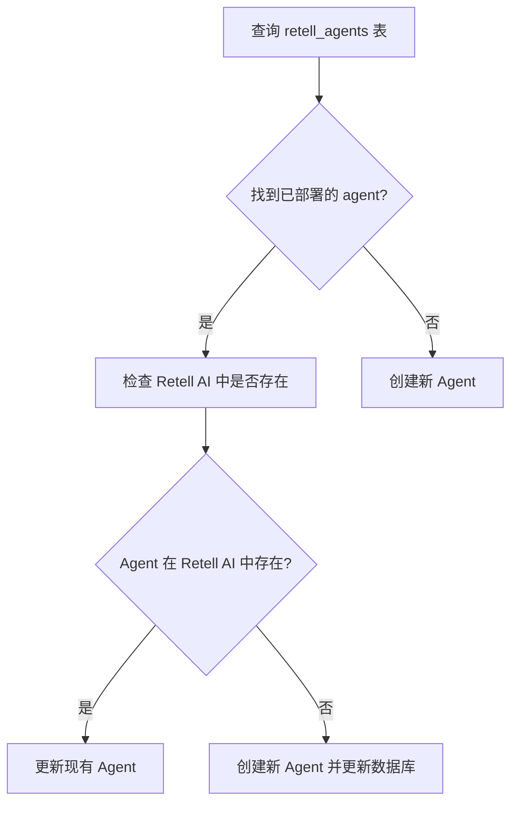
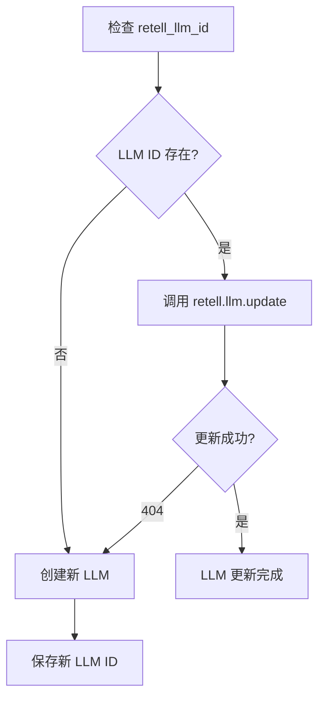
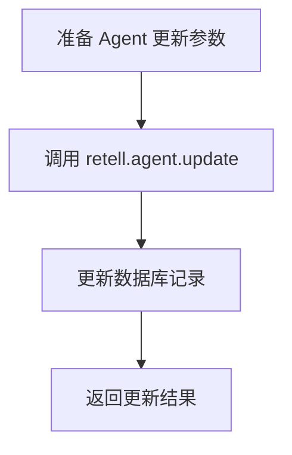
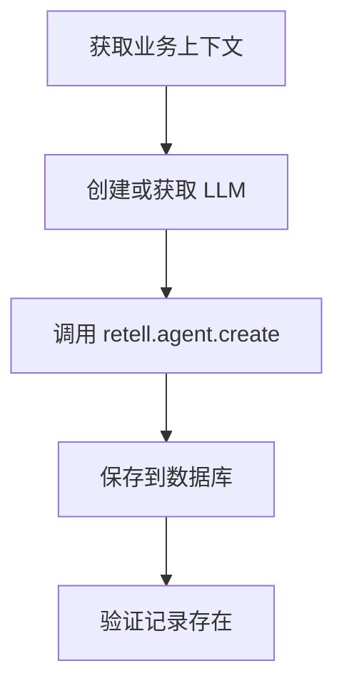

# Deploy Single Agent API 流程文档

## 概述

`/api/retell/deploy-single` 接口实现了智能的单个 Agent 部署和更新逻辑。该接口会检查现有部署，根据情况决定创建新 Agent 或更新现有 Agent。

## API 端点

```
POST /api/retell/deploy-single
```

## 请求参数

```json
{
  "agentConfig": {
    "agent_name": "AI Assistant",
    "basic_info_prompt": "You are a helpful assistant...",
    "call_scripts_prompt": "Handle calls professionally...",
    "voice_settings": {
      "voice_id": "11labs-Adrian",
      "speed": 1.28
    },
    "custom_instructions": "Additional guidelines..."
  }
}
```

## 完整执行流程

### 1. 认证与业务信息获取

```mermaid
graph TD
    A[POST /api/retell/deploy-single] --> B[withAuth() JWT验证]
    B --> C[获取 user.id]
    C --> D[查询 business_profiles]
    D --> E[获取 business_id]
    E --> F[验证 agentConfig]
```

**实现细节:**
- 使用 `withAuth()` 验证 JWT token 并返回认证上下文
- 从 `business_profiles` 表通过 `user_id` 获取对应的 `business_id`
- 使用认证的 Supabase 客户端确保 RLS 策略合规

### 2. 检查现有部署状态



**查询条件:**
```sql
SELECT * FROM retell_agents 
WHERE business_id = ? AND status = 'deployed'
```

### 3. Retell AI 存在性验证

```javascript
// 检查 Agent 是否在 Retell AI 中存在
try {
  const retellAgent = await this.retell.agent.retrieve(existingAgent.retell_agent_id);
  // Agent 存在，执行更新逻辑
} catch (error) {
  if (error?.status === 404) {
    // Agent 不存在，创建新的
  }
}
```

### 4. 更新现有 Agent (updateExistingAgent)

#### 4.1 LLM 更新流程



**LLM 更新请求:**
```javascript
const llmUpdatePayload = {
  general_prompt: comprehensivePrompt,
  begin_message: this.generateBeginMessage(businessContext),
  model_name: 'gpt-4o-mini'
};

await this.retell.llm.update(existingAgent.retell_llm_id, llmUpdatePayload);
```

#### 4.2 Agent 更新流程



**Agent 更新请求:**
```javascript
const agentUpdatePayload = {
  agent_name: config.agent_name,
  voice_id: config.voice_settings?.voice_id || '11labs-Adrian',
  language: 'en-US',
  webhook_url: `${process.env.NEXT_PUBLIC_SITE_URL}/api/retell/webhook`,
  response_engine: {
    type: 'retell-llm',
    llm_id: existingAgent.retell_llm_id
  }
};

await this.retell.agent.update(existingAgent.retell_agent_id, agentUpdatePayload);
```

### 5. 创建新 Agent (deployRoleAgent)

当没有现有 Agent 或 Retell AI 中不存在时，执行创建逻辑：



### 6. 数据库更新

#### retell_agents 表更新
```sql
-- 更新现有记录
UPDATE retell_agents 
SET 
  agent_name = ?,
  retell_llm_id = ?,
  updated_at = NOW(),
  user_id = ?
WHERE id = ?

-- 或插入新记录
INSERT INTO retell_agents (
  business_id, user_id, agent_type, retell_agent_id,
  agent_name, ai_agent_id, status, retell_llm_id
) VALUES (...)
```

#### agent_deployments 表更新
```sql
INSERT INTO agent_deployments (
  business_id, deployment_type, agents_deployed,
  agent_ids, status, deployed_at
) VALUES (?, 'retell', 1, [agent_id], 'active', NOW())
```

## 响应格式

### 成功响应
```json
{
  "success": true,
  "agent": {
    "agent_id": "retell_agent_123",
    "agent_name": "Business Name AI Assistant",
    "voice_id": "11labs-Adrian",
    "status": "deployed"
  },
  "message": "Successfully deployed agent: AI Assistant"
}
```

### 错误响应
```json
{
  "error": "Deployment failed",
  "details": "具体错误信息",
  "status": 500
}
```

## 核心特性

### 1. 智能检测机制
- **双重验证**: 数据库记录 + Retell AI 实际存在性
- **自动修复**: 数据不一致时自动创建新资源

### 2. 优雅降级处理
- LLM 404 → 自动创建新 LLM
- Agent 404 → 自动创建新 Agent
- 数据库错误 → 多种插入方法重试

### 3. RLS 策略合规
- 所有数据库操作使用认证上下文
- 满足 `user_id = auth.uid()` RLS 策略
- 避免使用 admin 客户端绕过安全检查

### 4. 完整的日志记录
```javascript
this.logger.info('Updating existing agent:', {
  agentId: existingAgent.retell_agent_id,
  llmId: existingAgent.retell_llm_id
});
```

## 错误处理策略

### 1. 网络错误
- Retell API 调用失败时的重试机制
- 超时处理和错误日志记录

### 2. 数据一致性错误
- 数据库与 Retell AI 不同步时的修复逻辑
- 孤儿记录的自动清理

### 3. 权限错误
- RLS 策略违规时的详细错误信息
- 认证失败的处理流程

## 性能优化

### 1. 数据库查询优化
- 使用索引优化的查询条件
- 批量操作减少数据库调用

### 2. API 调用优化
- 避免重复的 Retell API 调用
- 缓存业务上下文信息

## 安全考虑

### 1. 数据隔离
- 严格的用户数据隔离
- RLS 策略确保数据安全

### 2. 输入验证
- agentConfig 参数验证
- SQL 注入防护

### 3. 错误信息安全
- 避免泄露敏感系统信息
- 用户友好的错误消息

## 使用示例

```bash
curl -X POST "https://demo1492.ddns.net/api/retell/deploy-single" \
  -H "Authorization: Bearer <JWT_TOKEN>" \
  -H "Content-Type: application/json" \
  -d '{
    "agentConfig": {
      "agent_name": "Customer Service Assistant",
      "basic_info_prompt": "You are a professional customer service representative...",
      "voice_settings": {
        "voice_id": "11labs-Adrian",
        "speed": 1.2
      }
    }
  }'
```

## 相关文件

- **API 路由**: `/src/app/api/retell/deploy-single/route.ts`
- **服务类**: `/src/lib/services/retell-deployment-service.ts`
- **认证辅助**: `/src/lib/api-auth-helper.ts`
- **数据库迁移**: `/docs/sql/modify-retell-agents-add-user-id.sql`

---

*文档生成时间: 2025-08-15*
*版本: 1.0*
*状态: 已实现并测试*